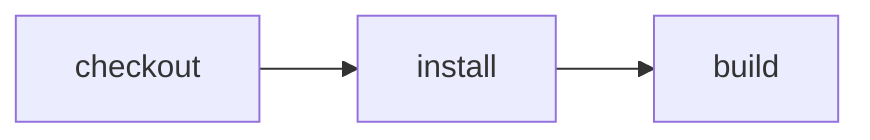

# Deploy Effect CI

> How do I keep source and pull requests on GitHub while every CI run is a native Cloudflare Workflow instance?



---

The first slice is a single-tenant service deployed in the repository owner's
Cloudflare account. It is similar in spirit to a hosted CI integration or Workers
Builds, but it is an independently deployable Effect CI service—not an emulation of either product.

Verified on a deployed account: a real GitHub App webhook started native
checkout/install/build with snapshots and returned successful GitHub checks with
command logs. One live-updated Slack checklist and inline approval followed by an
echo-only release are also verified. `cf-ci --remote` completed through an actual
`cloudflared` Access user session: instance `d94238ee-afdf-404f-aa63-ec013f8fcba1`
checked out source `cb851662300487cb033e1f1bd5586351f28c60eb`, installed and built,
streamed command output, and exited successfully after the terminal event.
This run used the Worker API token as well as Access; it did not deploy a release.

## Experience

1. Install the Effect CI GitHub App on a repository.
2. Push a commit or update a pull request.
3. GitHub immediately shows queued Effect CI checks.
4. A new Workflow instance appears in the Cloudflare dashboard.
5. The Workflow checks out the exact commit in the app's Sandbox-shim image,
   with Git and Node preinstalled by its own [Dockerfile](./Dockerfile).
6. Each action publishes its status and command output back to GitHub Checks.
7. The final GitHub result and Cloudflare Workflow result agree.

No GitHub Actions workflow or runner participates in that path.

```text
GitHub push / pull request
          │
          ▼
Effect CI GitHub App webhook
          │  verify signature + deduplicate delivery
          ▼
Cloudflare Worker ── create({ id: deliveryId, params }) ──▶ Workflow instance
                                                               │
                       GitHub Checks ◀── runtime events ─────────┤
                                                               ▼
                                                    Workspace Container
                                                    checkout → CI actions
```

## Trigger and identity

The GitHub App subscribes to `check_suite.requested` and
`check_suite.rerequested`. GitHub's default Checks flow emits `requested` after a push,
and `rerequested` gives the normal **Re-run** experience. The webhook supplies the App
installation, repository, and head SHA.

The Worker validates `X-Hub-Signature-256` before accepting a delivery. It uses
`X-GitHub-Delivery` as the Workflow instance ID, making webhook redelivery idempotent,
and responds after the exported Workflow accepts the instance. The durable Workflow—not
the request handler—owns the run.

## Discord / Slack notifications and HITL

Notifications and approval gates are separate. Configure `DISCORD_WEBHOOK_URL` and/or
`SLACK_WEBHOOK_URL` in the ignored `.secrets.env` file and redeploy with
`pnpm run deploy -- --secrets-file .secrets.env`.

For an existing Slack app, configure `SLACK_BOT_TOKEN` (the **Bot User OAuth Token**
under **OAuth & Permissions**, not the client secret or app-level token) and
`SLACK_CHANNEL_ID`. Install the app with the `chat:write` bot scope and invite the bot
to that channel. No Socket Mode connection, inbound Slack webhook, or Bolt server is
needed for outbound notifications. The starter in `apps/slack-app` in the main checkout
can remain unchanged; this service uses the same installed Slack app identity.

With a bot token the runner posts one Block Kit status card with a dependency-ordered
checklist and edits it as actions progress. Completed checks stay visible alongside
running, queued, skipped, and optional warning checks. Approval adds **Approve** and
**Reject** buttons to that same card; resolving approval removes them. The linked
`repo@7-character-sha • Details` context replaces the long revision and duplicate
Workflow footer. **Details** opens the native Cloudflare dashboard instance (configure `EFFECT_CI_DETAILS_URL`
with an instance URL template containing `{id}`). The final result updates the
card again. Status icons require only `chat:write`, not reaction permissions.
The template is `https://dash.cloudflare.com/ACCOUNT_ID/workers/workflows/WORKFLOW_NAME/instance/{id}`.
Its message timestamp is checkpointed for replay. If both
Slack bot credentials and a Slack webhook are configured, the bot takes precedence.
Discord also edits one checklist message using its webhook message ID. Slack incoming
webhooks cannot edit messages in this integration: use bot credentials for the single-card
experience; the webhook-only fallback still posts milestone messages.
Command output, event payloads, and exception bodies are not forwarded. Tokens and URLs
remain Worker secrets and never enter the build container. Failed notification
delivery is best-effort and does not fail CI; its result is checkpointed rather than
retried indefinitely. External delivery is not exactly-once: a crash after posting
but before checkpointing can duplicate a message.

Additional destinations can be supplied through `workflowEntrypoint`'s
`notificationProviders(environment, parameters)` option. Each provider has a stable
unique slug `id` and an Effect-returning `deliver(runSnapshot, previousReceipt)`.
Import `Notifications` and `notificationLayer` from
`@effect-ci-testbed/github-cloudflare/notifications` for standalone composition.
One service explicitly fans out to providers; merging competing layers for the same
service does not provide fan-out. Providers own their rendering and API calls, and
return serializable receipts containing message/comment IDs only. The hosted runner
serializes updates and checkpoints each provider independently; replay restores its
receipt without posting again. A provider failure does not fail CI or suppress another
destination. Shared snapshots omit command output, event payloads, approval summaries,
and approval capability tokens. Slack's existing inline approvals remain separate.
The `githubCommentProvider` factory is available from
`@effect-ci-testbed/github-cloudflare/github-comment`. Supply the verified repository,
PR number, App bot's numeric user ID, and a host-only installation-token callback.
It maintains **one comment per run/PR**, updating its checklist rather than posting
every event. Separate runs retain their own comments so a delayed older run cannot
overwrite a newer run. One single latest comment across all runs would additionally
need a shared coordinator; it is not this provider's contract.

The provider checks author identity, PR scope and the run/revision marker before an
edit, recovers an acknowledged post if its receipt was lost, and fails closed when
bounded discovery is ambiguous or exceeds 500 comments. API error bodies are never
forwarded and POST is not automatically retried. Discovery reduces duplicate posts
on replay, but a concurrent external post or ambiguous API acknowledgement is not
an exactly-once guarantee. Receipts contain only the comment ID and identity digest.

Posting needs **Pull requests: read and write** in the GitHub App's repository
permissions, followed by installation approval if prompted. Checks: write and
Contents: read remain unchanged; Issues: write and Contents: write are unnecessary.
This provider is tested locally against the API contract; it is **not enabled in the
deployed app**, and no live PR-comment integration is claimed until permission and
real delivery are verified. The extension never grants permission automatically.

Root-only `cf-ci run --remote` was also verified through Access in instance
`651bd288-5b3b-47bb-8b6f-b71b70fbd31c`. A deliberately dropped real event stream in
`2d28409b-7efd-45bd-909a-e82cd9830346` resumed at cursor `1`, completed successfully,
and dispatched only once. Bounded reconnects resume the same instance, not a new run.
An exhausted transport retry is not evidence that the Workflow failed; inspect that
instance before starting another run. Remote runs require a clean, pushed revision;
local checks still work on dirty files.

Discord: create a channel webhook under **Channel settings → Integrations → Webhooks**.
Slack: create an incoming webhook for the desired channel in your Slack app.
See [Discord webhooks](https://docs.discord.com/developers/resources/webhook) and
[Slack incoming webhooks](https://docs.slack.dev/messaging/sending-messages-using-incoming-webhooks/).

An action that yields `CI.Approval.request(...)` adds inline decision buttons and
pauses the Workflow until approved or rejected. Posting notifications alone never
creates an approval gate. Possession of a notification webhook does not grant release
permission. Slack decisions require a fresh, valid request signature, the configured
app, workspace and channel, an allowed reviewer, and a capability bound to this run
and approval request. Completed runs reject decisions. The Workflow consumes the first
decision event; button retries are not an exactly-once delivery guarantee.

For inline approvals, set `SLACK_SIGNING_SECRET`, `SLACK_APP_ID`, `SLACK_TEAM_ID`, and
`SLACK_APPROVER_IDS` (comma-separated Slack member IDs) alongside the bot credentials.
Missing approval configuration fails closed. In `.deploy.env`, explicitly enable
`EFFECT_CI_SLACK_CALLBACKS=true` to provision an Access exception **only** for
`/webhooks/slack`. Configure Slack **Interactivity & Shortcuts → Request URL** as
`https://YOUR_HOST/webhooks/slack`. This HTTP handler does not use Socket Mode: disable
Socket Mode for this app before enabling HTTP interaction delivery. Other routes remain
Access-protected. Do not paste credentials into chat or commit them.
The [HITL release example](../../examples/cloudflare-hitl-release) demonstrates the
approval action. The service builds by default. A remote request with `target: "release"`
builds first, updates the Slack card with decision buttons, waits for approval, and
then executes an echo-only deployment command. It never deploys production resources.
Unknown targets are rejected rather than silently running the default build.

### Native Workflow smoke test

From an authenticated `cf` session, the following starts the echo-only release demo.
Use an object-valued `params` in `--body`: the current CLI's `--params` flag delivers
a string payload instead.

```sh
cf workflows instances create effect-ci-github-cloudflare --body '{
  "params": {
    "trigger": "remote",
    "repository": "https://github.com/ericclemmons/effect-ci-testbed.git",
    "revision": "main",
    "target": "release"
  }
}'
```

For a real run, prefer an immutable commit SHA over `main`. Use the Slack card's
inline **Approve** or **Reject** button. **View Workflow** opens Cloudflare, where the
history shows a native `waitForEvent` until that decision. No custom approval page is used.
This tests the runner and approval path directly; GitHub webhook delivery/check
reporting and CLI authentication through Access need their own end-to-end tests.

## Authentication and secrets

This service needs only the GitHub App's minimum repository permissions:

- **Checks: read and write** to receive check-suite events and publish check runs.
- **Contents: read** to clone the selected revision.
- **Metadata: read**, which GitHub Apps receive automatically.

`GITHUB_APP_ID`, the App private key, and `GITHUB_WEBHOOK_SECRET` are Cloudflare
secrets. The webhook payload's installation ID is durable input; installation access
tokens are minted just in time, expire after one hour, and are never stored in Workflow
parameters or snapshots. The token authenticates both the Git clone and check updates.

Cloudflare resource access should use runtime capabilities rather than Cloudflare API
tokens. Because the Workflow and Container-backed Durable Object belong to this Worker,
the bridge reaches them through `ctx.exports`. Cross-Worker installations can provide
explicit bindings instead. Neither form adds a general-purpose Cloudflare credential to
the runtime.

## What is reusable

The implementation composes three reusable libraries:

- `@effect-ci-testbed/github` verifies webhook signatures, mints short-lived GitHub App
  installation tokens, and turns runtime events into plan and per-action checks.
- `@effect-ci-testbed/cloudflare` continues to own Workflow, Container, checkout,
  snapshot, and restore mechanics.
- `@effect-ci-testbed/github-cloudflare` is the small bridge that accepts a verified
  check-suite delivery, starts one native Workflow instance, and connects its runtime
  events to the GitHub reporter.

The deployable service lives in `apps/effect-ci`. Its Worker entrypoint selects the
portable build action from `examples/github-cloudflare-ci` and adds an echo-only
release target in `src/workflow.ts`. Reusable hosting behavior
lives in `packages/github-cloudflare`; examples contain consumer workflows and tests.

## First hosted run

This is the end-to-end setup for the current single-tenant prototype. It deploys the
service from this repository into your Cloudflare account and installs a private GitHub
App on repositories you select. It is not yet a packaged installer for an unrelated
repository.

You need:

- Node.js 24 or newer and pnpm;
- a Cloudflare account with Workers, Workflows, Containers, and Zero Trust available;
- permission to create a GitHub App for your user or organization; and
- a hostname in Cloudflare Access. The generated `workers.dev` hostname is sufficient.

### 1. Install, authenticate, and deploy

From the repository root:

```sh
pnpm install
cd apps/effect-ci
pnpm exec cf auth login
pnpm exec cf auth whoami
cp deploy.example.env .deploy.env
$EDITOR .deploy.env
pnpm run deploy
```

`cf` prints the deployed Worker URL. Save its origin, for example:

```sh
export EFFECT_CI_PUBLIC_URL=https://effect-ci-github-cloudflare.<subdomain>.workers.dev
```

Open the origin in a browser. Access should require a login before showing
`{"service":"Effect CI","status":"ready"}`. A public health response means Access
has not been provisioned correctly. Bearer authentication separately protects run
endpoints even before Access is configured.

### 2. Register the GitHub App

In GitHub, open **Settings → Developer settings → GitHub Apps → New GitHub App**.
For an organization-owned App, use the organization's **Developer settings** instead.

Configure:

| Field | Value |
| --- | --- |
| GitHub App name | A unique name such as `Eric's Effect CI` |
| Homepage URL | `$EFFECT_CI_PUBLIC_URL` |
| Webhook URL | `$EFFECT_CI_PUBLIC_URL/webhooks/github` |
| Webhook secret | A new high-entropy value; save it for the next step |
| SSL verification | Enabled |
| Checks permission | Read and write |
| Contents permission | Read-only |
| Subscribe to events | Check suite |
| Where can this App be installed? | Only on this account for this prototype |

OAuth callbacks, user authorization, and device flow are not needed. After creating the
App:

1. record its numeric **App ID**;
2. select **Generate a private key** and save the downloaded PEM; and
3. select **Install App** and grant it access to the repository you want to build.

GitHub sends `check_suite.requested` after a push and
`check_suite.rerequested` when a user selects **Re-run**. No `push` webhook subscription
is required for this flow.

### 3. Configure Worker secrets

Generate a second secret for the direct `/runs` API. Do not reuse the GitHub webhook
secret:

```sh
export EFFECT_CI_API_TOKEN="$(openssl rand -hex 32)"
```

Copy the ignored secret-file template and fill in its values. Quoted dotenv values
can span lines, so paste the private key as the original PEM rather than flattening it:

```sh
cp secrets.example.env .secrets.env
$EDITOR .secrets.env
pnpm run deploy -- --secrets-file .secrets.env
```

`.secrets.env` is ignored by Git. Do not rename it to the checked-in example filename or
put the PEM, webhook secret, or API token directly in shell history. This second deploy
creates a new Worker version with all secrets atomically; no Wrangler command is needed.

### 4. Protect operator routes with Access

The service deliberately uses two independent trust boundaries:

| Route | Caller | Authentication |
| --- | --- | --- |
| `/webhooks/github` | GitHub | GitHub HMAC signature |
| `/webhooks/slack` (opt-in) | Slack | Slack HMAC, fresh timestamp, app/team/channel checks, reviewer allow-list, run-bound capability |
| All other paths, including `/` and `/runs/*` | `cf-ci` and human reviewers | Cloudflare Access plus the Worker API token or a scoped approval token for execution |

The checked-in [`access.config.ts`](./access.config.ts) defines two Access application
request bodies: a protected application covering the entire hostname, and a more
specific bypass application covering only `/webhooks/github`. GitHub cannot complete
an interactive Access login; the Worker continues to require its HMAC signature.
Enabling `EFFECT_CI_SLACK_CALLBACKS=true` adds a third, equally narrow application for
`/webhooks/slack`. It does not bypass Access for the rest of `/webhooks/*`.

The installed `cf/config` API has no Access resource declarations. Consequently,
bare `cf deploy` provisions the Worker, Workflow, and Container, but does **not**
apply Access. This app's `pnpm run deploy` first reconciles `access.config.ts` through
the `cf` Access API commands, then calls `cf deploy`. It fails before deployment
if the account, hostname, reviewer list, or Access provisioning is missing.

The ignored `.deploy.env` supplies the account, public URL, reviewer emails, and
optional existing Access service-token ID. The secret values stay in `.secrets.env`.
Use `pnpm run deploy -- --secrets-file .secrets.env` to upload those with deployment.
`pnpm run deploy:access` applies only the Access configuration to an existing service.
`pnpm run deploy -- --dry-run` prints the Access plan and builds the Worker without
changing either deployment or Access policies.
When the native configuration API supports Access, this companion can move into
`cloudflare.config.ts`.

In **Cloudflare Zero Trust → Access controls → Applications**:

1. create a **Self-hosted** application;
2. use `<worker-hostname>` as the domain to protect the entire service;
3. add an **Allow** policy for the people permitted to review releases;
4. go to **Access controls → Service credentials → Service Tokens** and create an
   `Effect CI CLI` token; and
5. add a **Service Auth** policy to the application that includes that service token;
6. create a second **Self-hosted** application for the exact path
   `<worker-hostname>/webhooks/github`, with a **Bypass → Everyone** policy.

Verify that an unauthenticated visit to `/` redirects to Access, an unauthenticated
request to `/runs` cannot start a run, and GitHub's webhook reaches the Worker without
an Access login. An unsigned webhook must still return `401`.

Save the service token when it is created; Cloudflare shows its secret only once:

For a developer's existing Access identity, no service token is necessary:

```sh
cloudflared access login "$EFFECT_CI_PUBLIC_URL"
export CF_ACCESS_TOKEN="$(cloudflared access token --app "$EFFECT_CI_PUBLIC_URL")"
```

The token expires with your Access session. `cf-ci` sends it as `CF-Access-Token`
and still requires the Worker API token. For unattended execution, use the scoped
service-token pair instead (unset `CF_ACCESS_TOKEN` first):

```sh
export CF_ACCESS_CLIENT_ID='<access-client-id>'
export CF_ACCESS_CLIENT_SECRET='<access-client-secret>'
```

The Worker still checks `EFFECT_CI_API_TOKEN` after Access succeeds. That defense in
depth prevents an accidentally unprotected route from becoming a public execution API.

### 5. Run the first Workflow

First exercise the same deployed service directly from the checkout:

```sh
cd ../..
export EFFECT_CI_REMOTE_URL="$EFFECT_CI_PUBLIC_URL"
export EFFECT_CI_REMOTE_TOKEN="$EFFECT_CI_API_TOKEN"

pnpm exec cf-ci run --remote
```

The CLI should create a native Workflow instance, stream action events, and exit with
the Workflow result. Remote execution uses the service's configured workflow; it
does not upload or execute an arbitrary local workflow module. The CLI supplies the
Git repository and pushed commit, not dirty working-tree files. Run locally for
pre-commit validation; commit and push before using `--remote`.
No local workflow is required to dispatch the hosted suite from a repository root.
If one exists (or `--workflow` is explicit), its configured custom remote runner
still takes precedence.

Then push a commit to the repository where the GitHub App is
installed. The successful GitHub path is:

1. GitHub App **Advanced → Recent deliveries** shows a successful `check_suite`
   delivery;
2. the commit immediately receives an **Effect CI / Cloudflare** queued check;
3. a new Workflow instance appears in the Cloudflare dashboard;
4. checkout, install, and build update their GitHub checks as they execute; and
5. both the summary check and Workflow finish with the same conclusion.

Select GitHub's **Re-run** action once as the final smoke test. It should create a new
Workflow for the new webhook delivery; redelivery of the same delivery ID remains
idempotent.

### Troubleshooting

- **No webhook delivery:** confirm the App is installed on that repository, **Checks**
  is read/write, and **Check suite** is selected.
- **Webhook returns 401:** the value stored in `GITHUB_WEBHOOK_SECRET` differs from the
  App's webhook secret. Inspect the response under the App's **Advanced** page.
- **Check stays queued:** inspect the Workflow instance and Worker logs in the
  Cloudflare dashboard.
- **Private clone fails:** confirm **Contents** is read-only and the App installation
  includes the repository. Installation tokens are minted just in time.
- **`cf-ci --remote` redirects to login:** the Access application needs a
  **Service Auth** policy containing the service token—not only a human Allow policy.
- **`cf-ci --remote` returns 401 after Access:** `EFFECT_CI_REMOTE_TOKEN` does not match
  the Worker's `EFFECT_CI_API_TOKEN` secret.

The Worker returns `202 Accepted` only after its exported Workflow accepts the delivery.
Repeating the same `X-GitHub-Delivery` returns the existing instance rather than
starting duplicate CI.

The complete userland Worker is deliberately this small:

```ts
import * as GitHubCloudflare from "@effect-ci-testbed/github-cloudflare"

import workflow from "./workflow.ts"

export { WorkspaceContainer } from "@effect-ci-testbed/github-cloudflare"

export default GitHubCloudflare.worker()
export const EffectCIWorkflow = GitHubCloudflare.workflowEntrypoint(workflow, {
  root: "examples/github-cloudflare-ci",
})
```

The repository's integration test injects fake GitHub APIs and a fake Workflow
capability into the reusable bridge. It proves that one valid signed delivery creates one
queued check and one Workflow instance, while redelivering the same
`X-GitHub-Delivery` creates neither again:

```sh
node --test examples/github-cloudflare-ci/.cloudflare/ci/tests/webhook.test.ts
```

These protocol tests do not count as hosted GitHub-to-Cloudflare coverage. That matrix
row remains unchecked until a real GitHub delivery completes; the native build and Slack
approval smoke tests already passed on the deployed service.

Run the app's local regression suite without credentials:

```sh
node --test packages/github-cloudflare/src/*.test.ts apps/effect-ci/src/workflow.test.ts apps/effect-ci/access.config.test.ts
```

## First-slice contract

- A real GitHub webhook starts exactly one native Workflow instance.
- The instance is visible and inspectable in the Cloudflare dashboard.
- The commit receives the existing plan and per-action GitHub checks.
- Check details contain action command output; failure output is visible on GitHub.
- Success, failure, and GitHub **Re-run** all work without GitHub Actions.
- A duplicate webhook delivery does not start duplicate CI.
- A failure concludes both the action check and Workflow as failed.

The same service also exposes Access-protected `/runs` and `/runs/:id/events`
endpoints. They power `cf-ci run --remote` without changing the GitHub webhook path.
Durable release approval and Discord notification are kept in the focused
[`cloudflare-hitl-release`](../../examples/cloudflare-hitl-release/README.md) example.

PR comments, annotations, cancellation, artifacts, and multi-tenant installation
management remain follow-up slices.

## Relevant platform behavior

- [GitHub's default Checks flow](https://docs.github.com/en/rest/guides/using-the-rest-api-to-interact-with-checks)
  sends `check_suite.requested` to installed Apps with Checks write permission.
- [Check runs](https://docs.github.com/en/rest/checks/runs) support Markdown summaries,
  detailed text, annotations, external IDs, and links back to the execution provider.
- [GitHub App installation tokens](https://docs.github.com/en/apps/creating-github-apps/authenticating-with-a-github-app/authenticating-as-a-github-app-installation)
  can authenticate API requests and HTTP Git clones.
- [Cloudflare Workflow bindings](https://developers.cloudflare.com/workflows/build/workers-api/)
  create and inspect native Workflow instances without managing an API token.
- [Cloudflare Access application paths](https://developers.cloudflare.com/cloudflare-one/access-controls/policies/app-paths/)
  allow the execution API to be protected without intercepting GitHub's webhook.
- [Cloudflare Access service tokens](https://developers.cloudflare.com/cloudflare-one/access-controls/service-credentials/service-tokens/)
  authenticate the non-interactive `cf-ci` client.
