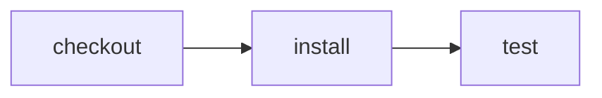

# Run Effect CI on Blacksmith

> How can Blacksmith run the same CI program that my agent runs locally?



---

Blacksmith supplies the GitHub job's compute; Effect CI supplies the portable
program. No Blacksmith layer or SDK import belongs in the workflow. This example
reuses the [runner-selection actions](../runner-selection/.cloudflare/ci/actions.ts)
to install dependencies and test a Worker's health handler.

Compare [ordinary GitHub YAML](./.github/workflows/github.yml), which uses
`runs-on: blacksmith-2vcpu-ubuntu-2404`, with the
[Effect caller](./.github/workflows/effect-on-github.yml), which passes that label
to the repository's [reusable runner](../../.github/workflows/effect-ci.yml).
The reusable runner executes this example's unchanged `workflow.ts`.

## Setup

1. Install the Blacksmith GitHub integration for an eligible organization and
   enable the repository, following the [Blacksmith quickstart](https://docs.blacksmith.sh/introduction/quickstart).
   Blacksmith currently does not support personal repositories.
2. Use an organization-owned fork of this testbed, retaining the shared actions,
   packages, and reusable runner. GitHub discovers only workflows in the
   repository-root `.github/workflows`, not this nested example directory.
3. Copy either comparison workflow to the root `.github/workflows`. Their paths
   already target `examples/blacksmith`. For the Effect version, configure the
   reusable runner's Effect CI GitHub App credentials
   ([service setup](../../apps/effect-ci/README.md)).

Locally, no provider account is needed:

```sh
pnpm cf-ci --workflow examples/blacksmith/.cloudflare/ci/workflow.ts
```

The local pipeline is verified. Actual Blacksmith execution remains unverified:
the testbed is a personal repository. An `ubuntu-latest` run or `act` simulation
does not establish Blacksmith coverage, so those matrix cells stay 🔜 until an
eligible repository completes both comparisons. No hosted provider job is added
to the testbed's automatic fanout, avoiding jobs queued for unavailable runners.
Cloudflare is not applicable to the Blacksmith compute-selection use-case.
