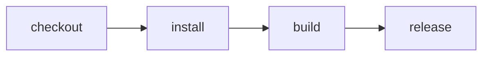

# Cloudflare human-approved release

> How do I build on Cloudflare, notify a reviewer, wait durably, and release only after approval?



---

The build and release are actions in one Effect CI workflow. `release()` yields
`build()`, then asks `CI.Approval` before executing the release command. On the
Cloudflare runner that request becomes a native `waitForEvent`; the Workflow can
hibernate until a reviewer responds without keeping a request or Container alive.

When `DISCORD_WEBHOOK_URL` is configured, the service posts the approval title,
summary, and review link to Discord. The link opens a provider-neutral approval page,
so Slack and Google Chat can later send the same URL without changing the workflow.
Approving or rejecting the form calls `sendEvent` on the exact Workflow instance.

## Deploy the single-tenant service

The example uses `cloudflare.config.ts`, including its Workflow and DO-managed
Container declarations:

```sh
pnpm install
pnpm --dir examples/cloudflare-hitl-release deploy
```

Configure these Worker secrets before using it:

- `EFFECT_CI_API_TOKEN` for local development or direct bearer authentication.
- `EFFECT_CI_PUBLIC_URL`, the deployed Worker origin used in approval links.
- `DISCORD_WEBHOOK_URL`, optional; omit it to use the approval URL directly.

Protect `/runs/*` with a Cloudflare Access self-hosted application. Human reviewers
authenticate through the Access policy, and every approval link also carries an HMAC
capability scoped to one instance and one approval request. The Worker never trusts an
unverified Access header on its own.

For `cf-ci --remote`, create an Access service token and expose its ID and secret to the
CLI as `CF_ACCESS_CLIENT_ID` and `CF_ACCESS_CLIENT_SECRET`. Also expose the Worker API
secret as `EFFECT_CI_REMOTE_TOKEN`; this defense in depth prevents an accidentally
unprotected `workers.dev` route from becoming a CI execution API.

The webhook route from the GitHub-backed service is independently authenticated with
GitHub's HMAC signature and must not be placed behind an interactive Access policy.

## Run remotely and follow it

From a Git checkout, point `cf-ci` at the deployed service:

```sh
EFFECT_CI_REMOTE_URL=https://effect-ci.example.com \
EFFECT_CI_REMOTE_TOKEN=... \
CF_ACCESS_CLIENT_ID=... \
CF_ACCESS_CLIENT_SECRET=... \
cf-ci run --remote
```

`cf-ci` submits the current remote URL, commit SHA, and ref, then subscribes to the
native Workflow event stream. Step starts, completions, retries, waits, and the final
result appear in the terminal as they happen. The initial slice clones public Git
repositories; private Git source uses the GitHub App flow demonstrated by
[`github-cloudflare-ci`](../github-cloudflare-ci/README.md).

For local Workflow-emulator development, run `pnpm dev`, dispatch a run through the
same `/runs` endpoint, and use the bearer secret. A local action run remains available
with `cf-ci run --local`; it uses the terminal approval adapter rather than
`waitForEvent`.
