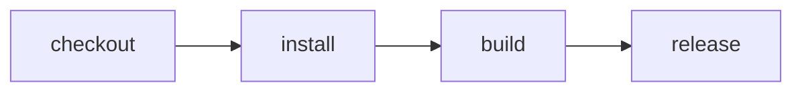

# Cloudflare human-approved release

> How do I build on Cloudflare, notify a reviewer, wait durably, and release only after approval?



---

The build and release are actions in one Effect CI workflow. `release()` yields
`build()`, then asks `CI.Approval` before executing the release command. On the
Cloudflare runner that request becomes a native `waitForEvent`; the Workflow can
hibernate until a reviewer responds without keeping a request or Container alive.

The deployed service maintains one Slack checklist message. A waiting release adds
inline **Approve** and **Reject** buttons; **View Workflow** opens the native
Cloudflare dashboard. A signed, authorized Slack decision sends an event to the exact
Workflow instance. No custom review page is needed. Discord notification support is
separate and still needs its own live approval proof.

## Deploy and secure the service

Use the deployable app in [`apps/effect-ci`](../../apps/effect-ci/README.md), not this
example fixture, for a hosted installation. Its guide covers `cf deploy`, the GitHub
App, Access policies, secrets, and Slack HTTP interactions. All execution endpoints
remain Access-protected. Only the signature-verified GitHub and opt-in Slack callback
paths bypass interactive Access.

For outbound Slack updates, use the installed app's bot token and channel ID. Inline
approval additionally requires its signing secret, app/team identity, and an explicit
reviewer allow-list. Keep these credentials in ignored Worker secret files; they do
not enter the workspace container. See the app's
[notification and approval setup](../../apps/effect-ci/README.md#discord--slack-notifications-and-hitl).

## Run remotely and follow it

From a clean Git checkout whose commit is pushed, point `cf-ci` at that deployed
service. Authenticate with a local `cloudflared` user token or an Access service-token
pair, plus the Worker API token:

```sh
EFFECT_CI_REMOTE_URL=https://effect-ci.example.com \
EFFECT_CI_REMOTE_TOKEN=... \
CF_ACCESS_CLIENT_ID=... \
CF_ACCESS_CLIENT_SECRET=... \
cf-ci run --remote \
  --workflow examples/github-cloudflare-ci/.cloudflare/ci/workflow.ts
```

`cf-ci` submits the repository URL, immutable commit SHA, and ref, then follows the
native Workflow event stream. Remote execution runs the service's configured workflow;
it does **not** upload an arbitrary local workflow or dirty working-tree files. The
local workflow argument selects the CLI entry point, not a remote module loader.
The [setup guide](../../apps/effect-ci/README.md#5-run-the-first-workflow) records a
successful live Access-authenticated remote run. Its
[release instructions](../../apps/effect-ci/README.md#discord--slack-notifications-and-hitl)
show how to request `target: "release"` and approve inline. The verified release is
echo-only: it proves durable approval, not a production deployment or health rollout.

For the portable local example, run:

```sh
cf-ci run --local --workflow examples/cloudflare-hitl-release/.cloudflare/ci/workflow.ts
```

It uses the terminal approval adapter rather than `waitForEvent`. For native Workflow
emulator development, use the app guide's `cf dev` instructions and local explorer.
