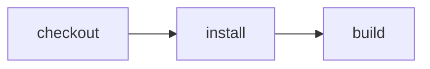

# Run Effect CI on Cloudflare

> How does one logical workspace survive durable `checkout → install → build` actions on Cloudflare?



---

## Hosted coverage

The [hosted example runner](../../apps/example-runner) completed
`coverage-workspace-20261008-3` with `reuseWorkspace: false`. Checkout, install, and
build each checkpoint their workspace, and subsequent actions restore the preceding
revision in a real Cloudflare account.

The action and workflow files use the same portable Effect CI API as the local and
GitHub examples. The Worker is intentionally userland-only:

```ts
import * as Cloudflare from "@effect-ci-testbed/cloudflare"

import workflow from "../.cloudflare/ci/workflow.ts"

export { WorkspaceContainer } from "@effect-ci-testbed/cloudflare"

export default {
  fetch() {
    return new Response("Effect CI Cloudflare runner")
  },
}

export const EffectCIWorkflow = Cloudflare.workflowEntrypoint(workflow, {
  reuseWorkspace: false,
})
```

`@effect-ci-testbed/cloudflare` uses Sandbox SDK 1.0 over a Durable Object Container.
The package supplies the common runner image: Node.js 24, Git, and the matching 1.0
`sandbox-shim`. Repositories do not copy that infrastructure into their own Workers.

- `CI.Source` clones the requested Git repository into the Container.
- An action that returns `CI.Workspace` commits a durable logical revision.
- `CI.Workspace.exec()` materializes that revision and uses the Container API.
- workspace file operations use Sandbox's file API rather than shell probes.
- The example disables live workspace reuse, forcing each consumer to restore the
  preceding revision and proving that persistence remains invisible to its actions.

The portable action expresses only the dependency and value flow:

```ts
export const install = CI.action("install", () => function* () {
  const workspace = yield* checkout()

  return yield* workspace.exec("npm ci")
})

export const build = CI.action("build", () => function* () {
  const workspace = yield* install()

  return yield* workspace.exec("npm run build")
})
```

## Compare GitHub and Effect CI

- [`.github/workflows/github.yml`](./.github/workflows/github.yml) expresses the same
  `checkout → install → build` pipeline directly in GitHub Actions YAML.
- [`.github/workflows/effect-on-github.yml`](./.github/workflows/effect-on-github.yml)
  runs [`.cloudflare/ci/workflow.ts`](./.cloudflare/ci/workflow.ts) on a GitHub runner.
- [`src/worker.ts`](./src/worker.ts) imports that same workflow and supplies the
  Cloudflare Workflow, Container, and snapshot implementation.

The action graph does not select a runner. GitHub and Cloudflare are adapters around
the same two userland files: `actions.ts` and `workflow.ts`.

`CI.action` expects a workspace by default; actions that intentionally produce another
value opt into it with a generic such as `CI.action<void>`. `install()` returns the
installed workspace—not a Cloudflare snapshot. The runner
associates that value with a snapshot revision. With normal reuse enabled, the next
action can continue in the live Container; after suspension, eviction, or deliberate
release, the same value transparently restores the correct revision.

The example exports `WorkspaceContainer` because Wrangler must discover the Durable
Object class named by `wrangler.jsonc`. Everything repository-specific remains in its
workflow and actions.

Start a local Worker with Docker running:

```sh
pnpm dev
```

Then trigger the native Workflow from another terminal:

```sh
pnpm exec wrangler workflows trigger effect-ci-cloudflare-runner \
  '{"repository":"https://github.com/ericclemmons/effect-ci-testbed.git","revision":"main"}' \
  --local
```

This local run intentionally exercises the production-shaped path: Workflow → Durable
Object → Sandbox Container → automatic commit → release → transparent restore → build.
It requires Docker and Wrangler 4.145 or newer. You can inspect the resulting instance
with Wrangler's local Workflow commands.

## Deliberate first-slice limits

This proves native workspace durability, not artifact publication. Container snapshots
are immutable, tied to their image version, and currently have an implicit 30-day TTL.
Portable build artifacts still need a separate artifact store. Restoring one install
snapshot into several Workspace Durable Objects for lint/test/build fan-out is the next
slice.
