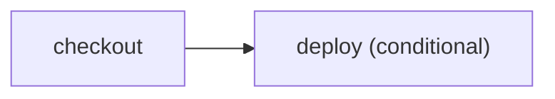

# Put inspectable conditions in a workflow plan

> How do I deploy only for a push to `main` without hiding that rule in arbitrary JavaScript?



---

`CI.when` accepts a small serializable condition algebra. The plan can display and
validate the branch before execution, and every runner evaluates the same predicate.
Ordinary Effect control flow remains available for decisions that are genuinely
runtime-only.

Property-based tests are useful for exercising combinations of events and refs, but
they cannot make an arbitrary JavaScript `if` inspectable. The declarative predicate is
what makes planning possible; tests verify its algebra.

## Current boundary: one desired action

Today `CI.when` wraps one action and the plan marks that desired node as conditional:

```ts
yield* CI.when(production, actions.deploy())
```

Its prerequisites are still discovered by executing the action in plan mode. At
runtime the condition is evaluated before the action, so a skipped deploy does not run
checkout. The plan renderer treats the condition as applying to that action's reachable
prerequisites.

That is not sufficient for an arbitrary Effect block:

```ts
if (["pull_request", "push"].includes(event.type)) {
  yield* actions.lint()
  yield* actions.test()
  yield* actions.build()
}
```

The JavaScript branch disappears from the serialized plan, while wrapping each leaf
duplicates the condition and wrapping a synthetic gate can draw the gate after its
children. A future conditional-scope API must make the branch itself a plan node and
place every enclosed action beneath it. Until that shape is implemented, use
`CI.when` for a single desired action and ordinary Effect control flow only when the
branch is intentionally runtime-only.

Run the canonical workflow locally:

```sh
pnpm cf-ci --workflow examples/conditional-deploy/.cloudflare/ci/workflow.ts
```

Compare [the conventional GitHub workflow](./.github/workflows/github.yml) with
[Effect on GitHub](./.github/workflows/effect-on-github.yml). The exhaustive event/ref
assertions live in
[`tests/conditional-deploy.test.ts`](./.cloudflare/ci/tests/conditional-deploy.test.ts),
not in the workflow entry point.

## Hosted coverage

The [hosted example runner](../../apps/example-runner) verifies both branches:
`coverage-conditional-push-20261008-1` executes the echo-only deployment for a main
push; `coverage-conditional-pull_request-20261008-1` skips deployment without
starting checkout. Its returned plan retains the inspectable condition.
