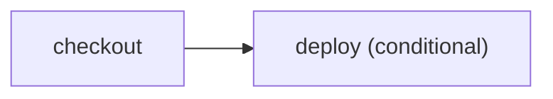

# Put inspectable conditions in a workflow plan

> How do I deploy only for a push to `main` without hiding that rule in arbitrary JavaScript?



---

`CI.when` accepts a small serializable condition algebra. The plan can display and
validate the branch before execution, and every runner evaluates the same predicate.
Ordinary Effect control flow remains available for decisions that are genuinely
runtime-only.

Property-based tests are useful for exercising combinations of events and refs, but
they cannot make an arbitrary JavaScript `if` inspectable. The declarative predicate is
what makes planning possible; tests verify its algebra.

Run the canonical workflow locally:

```sh
pnpm cf-ci --workflow examples/conditional-deploy/.cloudflare/ci/workflow.ts
```

Compare [the conventional GitHub workflow](./.github/workflows/github.yml) with
[Effect on GitHub](./.github/workflows/effect-on-github.yml). The exhaustive event/ref
assertions live in
[`tests/conditional-deploy.test.ts`](./.cloudflare/ci/tests/conditional-deploy.test.ts),
not in the workflow entry point.
