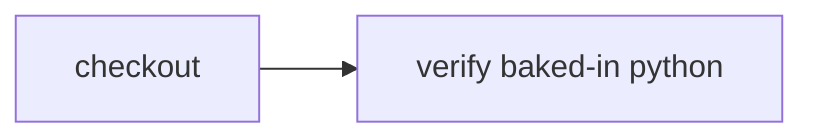

# Customize the Cloudflare runner image

> How do I bake operating-system tools into the CI image instead of installing them on every run?



---

The project-owned [Dockerfile](./Dockerfile) starts from Debian Trixie, installs Python,
and copies Cloudflare Sandbox 1.0's `sandbox-shim` into the image. The
[host app's Cloudflare configuration](../../apps/example-runner/cloudflare.config.ts)
builds that file with `cf deploy` as the named `workspace` image used by
`WorkspaceContainer`. The consumer actions do not change between runners.

The portable action only declares the capability it expects:

```ts
yield* workspace.exec("python3 --version")
```

Compare this with [installing a system package at runtime](../system-package) and
[preparing Python at runtime](../cloudflare-toolchain). A custom image has a larger
build and rollout boundary, but every workspace starts with the tool already present.
Runtime installation keeps the shared image generic and becomes part of the
checkpointed action graph.

From the repository root, with Docker running:

```sh
pnpm --filter @effect-ci-testbed/example-runner exec cf deploy
cf workflows instances create effect-ci-example-custom-runner-image \
  --body '{"instance_id":"custom-image-1","params":{"repository":"https://github.com/ericclemmons/effect-ci-testbed.git","revision":"COMMIT_SHA"}}'
cf workflows instances get custom-image-1 \
  --workflow-name effect-ci-example-custom-runner-image --simple true
```

Use a full committed SHA. The runner selects the custom image; the action verifies
Python without installing it at runtime. This is an outer runner image, not
[Docker-in-Docker](../docker-in-docker).

Hosted verification: `coverage-custom-image-20261008-1` completed at source revision
`bc50897f2d6ff8a388bcc6a0af22886f89bfc2c4`, with three native steps. The downstream
check restored checkout's snapshot and reported `Python 3.13.5`. Live workspace reuse
was disabled, so the result also verifies that the custom image survives snapshot
materialization.
