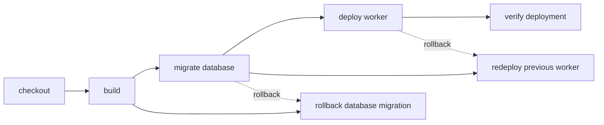

# Migrate D1 before deploying a Worker

> How do I guarantee that a required D1 migration completes before its Worker deploys?



---

The portable dependency graph is encoded in the actions themselves:

```text
checkout → build → migrate database → deploy worker → verify deployment
```

`deploy()` yields `migrate()`, and `migrate()` yields `build()`. Running the workflow—or
targeting `deploy` directly—therefore cannot skip either prerequisite. Each successful
action returns the next `CI.Workspace` revision, so a durable runner can checkpoint the
exact built and migrated filesystem consumed by deployment.

The fixture prints the real Wrangler command but records a local schema marker instead
of mutating a remote database. `deploy.mjs` refuses to continue unless both the build
output and expected migration marker exist.

Compare the conventional [GitHub Actions workflow](./.github/workflows/github.yml) with
the portable [actions](./.cloudflare/ci/actions.ts) and
[workflow](./.cloudflare/ci/workflow.ts).

## Rollback is not filesystem rewind

A workspace checkpoint cannot roll back D1 because the database is external state.
Each action that mutates external state owns its reversal:

```ts
export const migrate = CI.action("migrate database", migrateBody, {
  rollback: rollbackMigration,
})

export const deploy = CI.action("deploy worker", deployBody, {
  retries: { limit: 2, delay: "1 second", backoff: "exponential" },
  rollback: rollbackDeployment,
})
```

The safe default should be:

1. author expand/contract migrations that remain compatible with both Worker versions;
2. apply the forward migration;
3. attempt the new Worker deployment;
4. on failure, redeploy the last compatible Worker version;
5. run a down-migration only when the project explicitly defines one as safe and
   idempotent.

If migration itself fails after retries, its rollback runs. If deployment or its health
check fails, the runtime unwinds completed external changes in reverse order:
deployment first, then migration. The original failure and every rollback remain
separate durable steps with their own outputs. If rollback also fails, the run preserves
both errors rather than replacing the original failure.

The portable plan contains rollback edges, unlike an ordinary hidden `Effect.catch`
branch, so a runner can present and resume the same recovery sequence.
