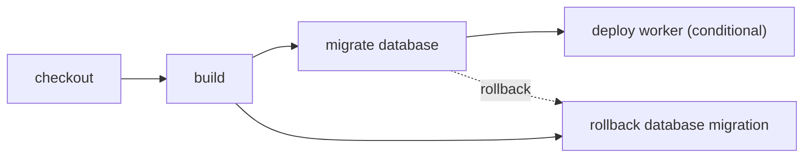

# Migrate D1 before deploying a Worker

> How do I guarantee that a required D1 migration completes before its Worker deploys?



---

The portable dependency graph is encoded in the actions themselves:

```text
checkout → build → migrate database → deploy worker
```

`deploy()` yields `migrate()`, and `migrate()` yields `build()`. Running the workflow—or
targeting `deploy` directly—therefore cannot skip either prerequisite. This is a real
Cloudflare project: [`cloudflare.config.ts`](./cloudflare.config.ts) declares its D1
binding, [`migrations/0001_create_users.sql`](./migrations/0001_create_users.sql)
creates the schema, and the Worker queries that table.

The checked example is deliberately credential-free. It uses `cf build`, applies the
real migration to a locally persisted D1 database, and validates the exact Build Output
with `cf deploy --prebuilt --mode production --dry-run`. A production runner supplies
`CLOUDFLARE_API_TOKEN`, `CLOUDFLARE_ACCOUNT_ID`, and the D1 database ID, replaces
the fixture's local database ID, removes
`--local` from the migration, and removes `--dry-run` from deployment. Those execution
choices belong to the runner layer; the action ordering does not change.

Compare the conventional [GitHub Actions workflow](./.github/workflows/github.yml) with
the portable [actions](./.cloudflare/ci/actions.ts) and
[workflow](./.cloudflare/ci/workflow.ts).

## Rollback is not filesystem rewind

A workspace checkpoint cannot roll back D1 because the database is external state.
Each action that mutates external state owns its reversal:

```ts
export const migrate = CI.action("migrate database", migrateBody, {
  rollback: rollbackMigration,
})

export const deploy = CI.action("deploy worker", deployBody, {
  retries: { limit: 2, delay: "1 second", backoff: "exponential" },
})
```

The safe default should be:

1. author expand/contract migrations that remain compatible with both Worker versions;
2. apply the forward migration;
3. attempt the new Worker deployment;
4. on failure, redeploy the last compatible Worker version;
5. run a down-migration only when the project explicitly defines one as safe and
   idempotent.

This fixture's deployment is a dry run, so it has no deployment state to reverse. Its
local migration owns an explicit SQL reversal and resets the local migration ledger so
the example is repeatable. Do not delete a production D1 migration record this way.
Production should use an expand/contract migration, a corrective forward migration, or
a D1 Time Travel restore selected by project policy. A production deployment action
can additionally own a Worker rollback; when a later health check fails, the runtime
unwinds the Worker deployment and then any explicitly safe database reversal in reverse
completion order.

The portable plan contains rollback edges, unlike an ordinary hidden `Effect.catch`
branch, so a runner can present and resume the same recovery sequence.
