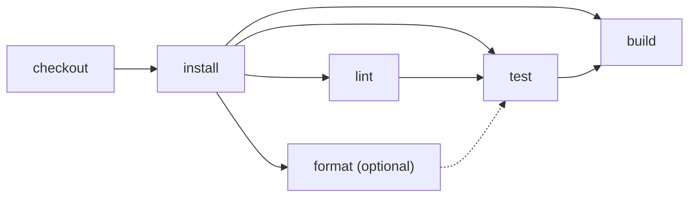

# Select dependency-aware reruns

> If one action is rerun, which successful actions can Effect CI safely reuse?



---

Effect CI derives dependencies from actions yielding other actions. It reruns the
requested action and everything that consumed it, while preserving unrelated siblings.
Plain sequencing controls order without pretending that the later action consumed the
earlier action's output.

Run the workflow locally:

```sh
pnpm cf-ci --workflow examples/dependency-aware-reruns/.cloudflare/ci/workflow.ts
```

The rerun-selection assertions live separately in
[`ci/tests/dependency-aware-reruns.test.ts`](./.cloudflare/ci/tests/dependency-aware-reruns.test.ts).

The example proves these cases:

- rerun `test` → rerun `test` and `build`; reuse `lint` and `format`
- rerun `install` → rerun all checks and `build`; reuse `checkout`
- rerun optional `format` → rerun only `format`

This example is deliberately only the selection primitive, so GitHub and Cloudflare
rerun adapters remain roadmap work. See
[`immutable-attempts`](../immutable-attempts) for creating a new attempt, restoring
reusable node outputs, and executing the selected subgraph without changing history.
