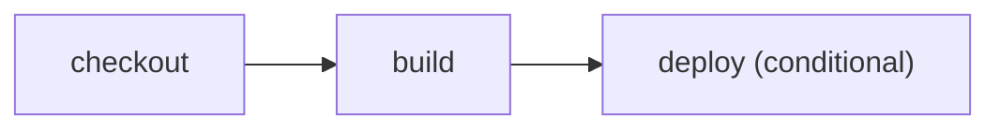

# Trigger deployment from a hook

> How do I route a deployment hook into the same inspectable build and deploy graph?



---

The workflow accepts normalized `deploy_hook` events from a generic HTTP adapter and
GitHub's native `deployment` event. Both routes request the same conditional deploy
action; the plan retains that event predicate.

The fixture uses a real Worker build and a credential-free deployment dry-run:

```text
checkout → cf build → cf deploy --prebuilt --dry-run
```

Run the generic hook locally:

```sh
EFFECT_CI_EVENT=deploy_hook pnpm exec cf-ci
```

Compare the conventional [GitHub Actions workflow](./.github/workflows/github.yml)
with [Effect CI on GitHub](./.github/workflows/effect-on-github.yml). Receiving an HTTP
hook and creating a hosted Cloudflare Workflow instance remains part of the hosted
service adapter, not this portable workflow.
