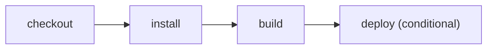

# Trigger deployment from a hook

> How do I route a deployment hook into the same inspectable build and deploy graph?



---

The workflow accepts normalized `deploy_hook` events from a generic HTTP adapter and
GitHub's native `deployment` event. Both routes request the same conditional deploy
action; the plan retains that event predicate.

The fixture uses a real Worker build and a credential-free deployment dry-run:

```text
checkout → npm ci → cf build → cf deploy --prebuilt --dry-run
```

Run the generic hook locally:

```sh
EFFECT_CI_EVENT=deploy_hook pnpm exec cf-ci
```

Compare the conventional [GitHub Actions workflow](./.github/workflows/github.yml)
with [Effect CI on GitHub](./.github/workflows/effect-on-github.yml). Receiving an HTTP
hook and creating a hosted Cloudflare Workflow instance remains part of the hosted
service adapter, not this portable workflow.

The [hosted example runner](../../apps/example-runner) verifies both supported
event types using fresh durable workspaces: frozen installation, a real build,
and a credential-free deployment dry-run. A pull-request event skips the whole
deployment branch without starting a container. No production release occurs;
accepting and authenticating an HTTP webhook is a separate service concern.

The standalone conventional YAML also passed on a real GitHub-hosted runner in
[job 113866868572](https://github.com/ericclemmons/effect-ci-testbed/actions/runs/37944415004/job/113866868572)
at revision `927ff9093da7c21edacf88a4a6fe28ac428fb2b3`. The root suite stages this
example independently and runs its `workflow_dispatch` path with `act`, so neither
the TypeScript config nor the locked dependencies can rely on the monorepo root.
