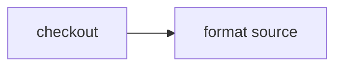

# Run source checks in a Worker isolate

> How do I format-check source without paying to execute the formatter inside a container?



---

The action reads one source file through `CI.Workspace`, then runs Prettier's browser
bundle in the host JavaScript runtime:

```ts
const source = yield* workspace.readFile("app/src/index.ts")
const formatted = yield* Effect.tryPromise(() => prettier.format(source, options))
```

On Cloudflare the source read crosses the narrow workspace RPC boundary, but Prettier
runs in the Workflow Worker isolate. It does not consume Container CPU or memory. The
same action runs under Node.js locally and on a GitHub runner.

This proves a source-in/result-out execution tier, not arbitrary project execution.
Oxlint, Oxfmt, and Vitest can use the same path when they expose Worker-compatible
JavaScript or Wasm APIs. Loading untrusted project modules belongs in a Cloudflare
Dynamic Worker with explicit capability bindings and remains separate roadmap work.

The [hosted example runner](../../apps/example-runner) imports this workflow unchanged.
Instance `coverage-source-checks-20261009-1` completed both actions with live workspace
reuse disabled. Its three native steps only checkout, checkpoint, and read the source;
the formatter runs in the Worker, with no container command or new workspace snapshot.
Platform configuration belongs to that app rather than this consumer example.

Compare the conventional [GitHub Actions workflow](./.github/workflows/github.yml) with
the portable [actions](./.cloudflare/ci/actions.ts) and
[workflow](./.cloudflare/ci/workflow.ts).
