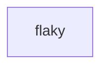

# Retry and time out actions consistently

> How do retries and timeouts mean the same thing locally and on a durable runner?



---

Step policy belongs to the runner layer. Local and ordinary GitHub execution use
Effect's interruption-safe retry and timeout operators around the action body.
Cloudflare execution passes the same options to native `step.do`, so the Workflow
runtime owns its retry history and cancellation.

The conventional GitHub Actions comparison uses a shell retry loop because Actions has
a timeout setting but no equivalent native per-step retry policy.

The same Effect workflow is the executable local entry point and the input to the
reusable GitHub runner:

```sh
pnpm cf-ci --workflow examples/execution-policy/.cloudflare/ci/workflow.ts
```

Compare [the conventional GitHub workflow](./.github/workflows/github.yml) with
[Effect on GitHub](./.github/workflows/effect-on-github.yml). Assertions about retry
and interruption behavior live separately in
[`tests/execution-policy.test.ts`](./.cloudflare/ci/tests/execution-policy.test.ts).

`limit: 2` means two retries after the initial attempt. Timeout applies to each
attempt, not to the combined lifetime of all retries.
