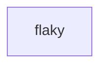

# Retry and time out actions consistently

> How do retries and timeouts mean the same thing locally and on a durable runner?



---

Step policy belongs to the runner layer. Local and ordinary GitHub execution use
Effect's interruption-safe retry and timeout operators around the action body.
Cloudflare runs policy-bearing leaf bodies in native `step.do`, including pure
Effects, commands, and the resulting workspace checkpoint. Failed exits and failed
checkpoints throw inside that boundary; Workflows must not cache them as success.

Resolve dependencies during action construction, then return the work to retry:

```ts
const build = CI.action("build", function* () {
  const workspace = yield* install()
  return () => workspace.exec("npm run build")
}, { retries: { limit: 2, delay: "1 second" } })
```

The build's policy does not retry installation. Dependencies invoked inside a
native policy body are rejected; resolve them before returning the body instead.
`CI.Attempt` supplies the current one-based attempt on either runner, without relying
on module memory surviving Workflow hibernation. Cloudflare's `NonRetryableError`
ends native retries immediately. Actions without explicit policies retain individual
command checkpoints. Native body results support Workspace, void, or serializable
data—not arbitrary live service objects.

The [host app](../../apps/example-runner#native-action-body-policy)
records live success, timeout, exhaustion, terminal-error, and command-retry proofs.
Its [checkpoint recovery proof](../../apps/example-runner#cache-and-checkpoint-correctness)
also replaces the live container before failing the first commit, then verifies the
rebuilt second attempt from its saved revision. Retrying the body can repeat commands
and external effects: use idempotent operations or provider-side deduplication. A
workspace snapshot does not make an external deployment or database write atomic.

The conventional GitHub Actions comparison uses a shell retry loop because Actions has
a timeout setting but no equivalent native per-step retry policy.

The same Effect workflow is the executable local entry point and the input to the
reusable GitHub runner:

```sh
pnpm cf-ci --workflow examples/execution-policy/.cloudflare/ci/workflow.ts
```

Compare [the conventional GitHub workflow](./.github/workflows/github.yml) with
[Effect on GitHub](./.github/workflows/effect-on-github.yml). Assertions about retry
and interruption behavior live separately in
[`tests/execution-policy.test.ts`](./.cloudflare/ci/tests/execution-policy.test.ts).

`limit: 2` means two retries after the initial attempt. Timeout applies to each
attempt, not to the combined lifetime of all retries.
