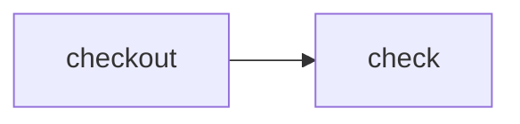

# Expose selected actions to `cf-ci`

> How do I let an agent or developer run one action without making every internal
> action a public CLI target?



---

The workflow default-exports the complete pipeline and explicitly re-exports only
`check`:

```ts
const workflow = CI.workflow("exported-actions", () => actions.check())

export { check } from "./actions.ts"
export default workflow
```

`checkout` remains an implementation detail even though `check` depends on it. From
this example directory:

```sh
pnpm exec cf-ci list
pnpm exec cf-ci run check
pnpm exec cf-ci run checkout # CI_UNKNOWN_TARGET
```

The CLI discovers `.cloudflare/ci/workflow.ts` from the current directory. It treats
only named exports created by `CI.action` as direct targets, so runner configuration
and ordinary helper functions cannot accidentally become commands.
