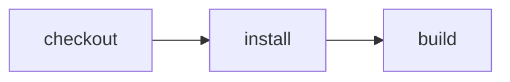

# GitHub source, Cloudflare CI

> How do I keep source on GitHub and execute checkout, install, and build in a Cloudflare Workflow that reports GitHub checks?



---

This directory contains the application being built, portable CI actions, the
workflow, and integration tests. The deployable service and setup instructions
live in [`apps/effect-ci`](../../apps/effect-ci/README.md).

The service imports this example's workflow. GitHub's signed check-suite event
supplies the repository and revision; a native Cloudflare Workflow executes the
actions and reports their status and logs back to GitHub.

Run the example locally from the repository root:

```sh
pnpm exec cf-ci run --workflow examples/github-cloudflare-ci/.cloudflare/ci/workflow.ts
```

After deploying and configuring the service, dispatch its configured workflow remotely:

```sh
pnpm exec cf-ci run --remote --workflow examples/github-cloudflare-ci/.cloudflare/ci/workflow.ts
```

`--remote` submits the pushed commit to the configured service and tails its events.
It does not upload local edits or the selected TypeScript module. Dirty working trees
are rejected to prevent remote results being mistaken for validation of local changes.
Access service credentials and the Worker API token are both required; see the
[setup guide](../../apps/effect-ci/README.md#5-run-the-first-workflow).
