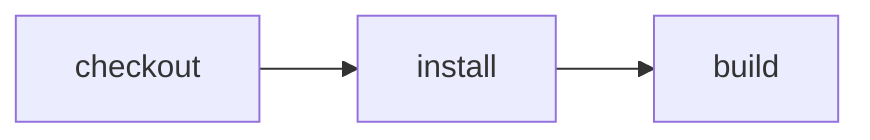

# Run GitHub-source CI entirely on Cloudflare

> How do I keep source and pull requests on GitHub while every CI run is a native Cloudflare Workflow instance?



---

The first slice is a single-tenant service deployed in the repository owner's
Cloudflare account. It is similar in spirit to a hosted CI integration or Workers
Builds, but it is explicitly an Effect CI example—not an emulation of either product.

## Experience

1. Install the Effect CI GitHub App on a repository.
2. Push a commit or update a pull request.
3. GitHub immediately shows queued Effect CI checks.
4. A new Workflow instance appears in the Cloudflare dashboard.
5. The Workflow checks out the exact commit and runs in a managed Container.
6. Each action publishes its status and command output back to GitHub Checks.
7. The final GitHub result and Cloudflare Workflow result agree.

No GitHub Actions workflow or runner participates in that path.

```text
GitHub push / pull request
          │
          ▼
Effect CI GitHub App webhook
          │  verify signature + deduplicate delivery
          ▼
Cloudflare Worker ── create({ id: deliveryId, params }) ──▶ Workflow instance
                                                               │
                       GitHub Checks ◀── runtime events ─────────┤
                                                               ▼
                                                    Workspace Container
                                                    checkout → CI actions
```

## Trigger and identity

The GitHub App subscribes to `check_suite.requested` and
`check_suite.rerequested`. GitHub's default Checks flow emits `requested` after a push,
and `rerequested` gives the normal **Re-run** experience. The webhook supplies the App
installation, repository, and head SHA.

The Worker validates `X-Hub-Signature-256` before accepting a delivery. It uses
`X-GitHub-Delivery` as the Workflow instance ID, making webhook redelivery idempotent,
and responds after the exported Workflow accepts the instance. The durable Workflow—not
the request handler—owns the run.

## Authentication and secrets

This example needs only the GitHub App's minimum repository permissions:

- **Checks: read and write** to receive check-suite events and publish check runs.
- **Contents: read** to clone the selected revision.
- **Metadata: read**, which GitHub Apps receive automatically.

`GITHUB_APP_ID`, the App private key, and `GITHUB_WEBHOOK_SECRET` are Cloudflare
secrets. The webhook payload's installation ID is durable input; installation access
tokens are minted just in time, expire after one hour, and are never stored in Workflow
parameters or snapshots. The token authenticates both the Git clone and check updates.

Cloudflare resource access should use runtime capabilities rather than Cloudflare API
tokens. Because the Workflow and Container-backed Durable Object belong to this Worker,
the bridge reaches them through `ctx.exports`. Cross-Worker installations can provide
explicit bindings instead. Neither form adds a general-purpose Cloudflare credential to
the runtime.

## What is reusable

The implementation composes three reusable libraries:

- `@effect-ci-testbed/github` verifies webhook signatures, mints short-lived GitHub App
  installation tokens, and turns runtime events into plan and per-action checks.
- `@effect-ci-testbed/cloudflare` continues to own Workflow, Container, checkout,
  snapshot, and restore mechanics.
- `@effect-ci-testbed/github-cloudflare` is the small bridge that accepts a verified
  check-suite delivery, starts one native Workflow instance, and connects its runtime
  events to the GitHub reporter.

The example itself contains only GitHub App registration instructions, its
portable actions/workflow, a small Worker entrypoint, and `cloudflare.config.ts`.

## Set up the single-tenant service

Create a GitHub App owned by the same user or organization as the target repository:

- Webhook URL: `https://<worker>.workers.dev/webhooks/github`
- Webhook: active, with a generated secret
- Repository permissions: **Checks: read and write**, **Contents: read-only**
- Subscribe to **Check suite** events
- Install it on the repositories this service may build

Generate a private key, then configure the deployed Worker without committing any
credential:

```sh
pnpm --filter effect-ci-github-cloudflare-fixture exec wrangler secret put GITHUB_APP_ID
pnpm --filter effect-ci-github-cloudflare-fixture exec wrangler secret put GITHUB_PRIVATE_KEY
pnpm --filter effect-ci-github-cloudflare-fixture exec wrangler secret put GITHUB_WEBHOOK_SECRET
pnpm --dir examples/github-cloudflare-ci deploy
```

`GITHUB_PRIVATE_KEY` accepts the PEM directly or with newlines encoded as `\\n`.
The Worker returns `202 Accepted` only after its exported Workflow accepts the delivery.
Repeating the same `X-GitHub-Delivery` returns the existing instance rather than
starting duplicate CI.

The complete userland Worker is deliberately this small:

```ts
import * as GitHubCloudflare from "@effect-ci-testbed/github-cloudflare"

import workflow from "../.cloudflare/ci/workflow.ts"

export { WorkspaceContainer } from "@effect-ci-testbed/github-cloudflare"

export default GitHubCloudflare.worker()
export const EffectCIWorkflow = GitHubCloudflare.workflowEntrypoint(workflow)
```

The repository's integration test injects fake GitHub APIs and a fake Workflow
capability into the reusable bridge. It proves that one valid signed delivery creates one
queued check and one Workflow instance, while redelivering the same
`X-GitHub-Delivery` creates neither again:

```sh
node --test examples/github-cloudflare-ci/.cloudflare/ci/tests/webhook.test.ts
```

This does not count as hosted Cloudflare coverage. The matrix remains unchecked until
the Worker is deployed, its GitHub App is installed, and a real commit completes.

## First-slice contract

- A real GitHub webhook starts exactly one native Workflow instance.
- The instance is visible and inspectable in the Cloudflare dashboard.
- The commit receives the existing plan and per-action GitHub checks.
- Check details contain action command output; failure output is visible on GitHub.
- Success, failure, and GitHub **Re-run** all work without GitHub Actions.
- A duplicate webhook delivery does not start duplicate CI.
- A failure concludes both the action check and Workflow as failed.

The same service also exposes Access-protected `/runs` and `/runs/:id/events`
endpoints. They power `cf-ci run --remote` without changing the GitHub webhook path.
Durable release approval and Discord notification are kept in the focused
[`cloudflare-hitl-release`](../cloudflare-hitl-release/README.md) example.

PR comments, annotations, cancellation, artifacts, and multi-tenant installation
management remain follow-up slices.

## Relevant platform behavior

- [GitHub's default Checks flow](https://docs.github.com/en/rest/guides/using-the-rest-api-to-interact-with-checks)
  sends `check_suite.requested` to installed Apps with Checks write permission.
- [Check runs](https://docs.github.com/en/rest/checks/runs) support Markdown summaries,
  detailed text, annotations, external IDs, and links back to the execution provider.
- [GitHub App installation tokens](https://docs.github.com/en/apps/creating-github-apps/authenticating-with-a-github-app/authenticating-as-a-github-app-installation)
  can authenticate API requests and HTTP Git clones.
- [Cloudflare Workflow bindings](https://developers.cloudflare.com/workflows/build/workers-api/)
  create and inspect native Workflow instances without managing an API token.
