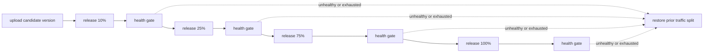

# Release a Worker only while its health remains acceptable

> How do I upload a candidate without releasing it, progressively shift traffic, and roll back on a confirmed regression?



---

Hosted HTTP-cohort rollout verified; WOBS integration and live notification graphs remain in progress.

Implemented foundations:

- [Dedicated demo Worker](../../apps/hmd-demo) with version-tagged healthy/failing profiles.
- [Health gate](../../packages/cloudflare/src/health-gate.ts) and tests for uncertainty,
  progression, regression, wrong cohorts, incomplete data, and sampled counts.
- [Historical confidence-envelope SVG renderer](../../packages/cloudflare/src/health-chart.ts).
- [Pure release policy](../../packages/cloudflare/src/release-policy.ts), preserving
  the previous multi-version split, bounding observations per phase, and requiring
  a health gate after 100% as well as intermediate phases.
- A host-only Analytics SQL availability probe; no analytics token enters a container.
- A [private fixed-target release broker](../../apps/release-manager) verified via
  real hosted promotion, replay and exact baseline rollback.
- A trusted hosted regression controller with checkpointed HTTP cohorts,
  one-minute uncertainty sleeps, non-retryable regression and immutable SVG snapshots.

The chart is an observed-data confidence envelope, not a forecast cone. The initial
binary-error estimator uses conservative anytime-valid Hoeffding bounds, allocating
the release's error budget across both cohorts, all sample counts, and configured
phase × metric comparisons. It assumes independent Bernoulli observations within
each cohort; correlated requests or repeated retries are not independent trials.
It does not interpret weighted SQL `COUNT(*)` values as a binomial sample size.
Sampled datasets remain uncertain until a justified sampling-aware estimator is
provided. A previous-time-window comparison also cannot establish causality when
the traffic mix changes; a simultaneous control cohort is a later stronger option.

Each gate pins the baseline version/window and candidate's phase start. The data
adapter must supply a closed ingestion watermark—query time is not that watermark.
Graphs can narrow as independent observations accumulate, but are not forced to
monotonically narrow or to declare success when data is absent.

`deploy` uploads an immutable Worker version without changing traffic. `release`
owns promotion and its reversal, capturing the previous deployment's complete
version/percentage mapping before any change. Rollback restores that mapping,
not the candidate's filesystem snapshot.

Each phase queries version-specific health observations collected after that phase
began. The release layer distinguishes three outcomes:

- **Healthy:** enough data and acceptable error rate; advance immediately.
- **Inconclusive:** insufficient or delayed data; throw a tagged retryable error
  containing the sample, then retry with a bounded one-minute delay.
- **Unhealthy:** conclusive threshold breach; throw a Cloudflare non-retryable
  error, then run the release action's rollback immediately.

Ten retries are a maximum observation budget, not a mandatory ten-minute soak.
Exhausting that budget fails closed and rolls back; missing analytics must never
mean healthy. Late samples and aggregate errors from an old version must not
trigger decisions for the new candidate. Concurrent releases need an ownership
guard so one rollback cannot overwrite another operator's deployment.

Cloudflare's [Analytics SQL binding](https://developers.cloudflare.com/analytics/sql-api/workers-binding/)
can query account-scoped datasets without injecting an API token into a container.
The [version metadata binding](https://developers.cloudflare.com/workers/runtime-apis/bindings/version-metadata/)
provides the version identity for telemetry. Native
[Workflow retries and non-retryable errors](https://developers.cloudflare.com/workflows/build/sleeping-and-retrying/)
provide the health gate's timing semantics.

Verification must cover a real dedicated demo Worker: successful promotion,
inconclusive samples followed by enough data, immediate unhealthy rollback,
observation-budget exhaustion, and preservation of the prior traffic allocation.
Local tests can use deterministic health samples, but they do not earn a hosted ✅.

## Verification and notification work remaining

A bounded [live regression test](../../apps/hmd-demo/ci/tests/live-rollback.test.ts)
has shifted the dedicated demo to 10% failing candidate, classified a real SLO
breach from version-attributed HTTP probes, and restored its exact previous
allocation. This proves the deployment API path, not a complete hosted controller
or WOBS ingestion/health adapter. Its ownership check is advisory, not an atomic
lock against external operators. The example remains 🔜.

### Hosted regression controller proof

Native Workflow `effect-ci-probe-hosted-hmd`, instance
`cf_155a3d325e03f0e3f81624b116e48b92c52d361ffd80539e6a172236d6ec2d1e`,
completed on October 10, 2026 through the private broker. The first candidate
sample was uncertain, so the Workflow slept one minute. The second crossed the
absolute SLO: candidate interval `[45.7%, 100%]`, previous interval `[0%, 27.4%]`.
The non-retryable health step ran **once** despite a ten-retry allowance, then
rollback restored healthy baseline `09593237-23b2-4873-bd04-88c8e8488840` at 100%
in deployment `d177c431-9a7d-447e-b0f4-7e3891f00540`.

Two complete SVG confidence snapshots survive in the Workflow's output. These
are historical bounds from real version-attributed client HTTP outcomes, **not**
WOBS ingestion evidence, production causal attribution or live notification images.
Every requested client probe must finish with a recognized version and matching
HTTP status before its window is closed. Lost, malformed or unknown responses keep
the whole cohort uncertain; no request is automatically retried or counted twice.

The controller is a bounded dedicated-target test, not configurable deployment of
arbitrary repositories. Invoke through authenticated Cloudflare API:

```sh
cf workflows instances create effect-ci-probe-hosted-hmd \
  --body '{"params":{"scenario":"regression"}}'
# Explicit incomplete-evidence fault injection; ten observations, one-minute waits:
cf workflows instances create effect-ci-probe-hosted-hmd \
  --body '{"params":{"scenario":"exhaustion"}}'
```

Do not run these simultaneously: one durable release owner guards the target.
Catchable controller failures restore the baseline and fail the lab, rather than
being reported as a successful expected regression. Fatal platform termination can
bypass JavaScript cleanup; independent automatic recovery remains unimplemented.
Complete WOBS windows and Slack/GitHub image delivery are still remaining work.

### Hosted healthy four-phase proof

`cf_dfba94116e4a9853b6d4a4f8cd171f933339591483e2e4ca151f904863fd0c2e`
completed all real **10% → 25% → 75% → 100%** promotions on October 10, 2026.
Each phase first returned uncertain, waited a native minute, then advanced only
after more independently requested, version-attributed HTTP observations. Final
candidate upper bounds were 4.76%, 4.72%, 4.66%, and 4.39% respectively, within the
10% absolute SLO and five-percentage-point increase budget. The eight immutable
SVG snapshots are complete in the Workflow output.

The final 100% health gate passed before dedicated-lab cleanup restored baseline
`09593237-23b2-4873-bd04-88c8e8488840` at 100% in deployment
`bd869ea5-8baf-40ab-b31a-d7be3569fd18`. This is a successful rollout **test**, not
a committed production release; output explicitly says `releaseCommitted: false`
and `wobsVerified: false`. The healthy candidate
`c94cee12-0bf4-48fb-bb42-9235f7ab7a3c` was uploaded separately without changing
the active allocation. No deployment token or imported repository code ran in
the controller.

```sh
cf workflows instances create effect-ci-probe-hosted-hmd \
  --body '{"params":{"scenario":"healthy"}}'
```

The exhaustion run
`cf_3f0258b1dcdce84da59b26874bc32414e1cf6b6ac856522f8000dc866fc04234`
completed ten explicitly incomplete observations, nine native one-minute sleeps,
then restored the baseline at 100% in deployment
`a0fec3c6-1713-4740-8039-761709e371c5`. It did not interpret missing evidence as healthy.

The initial healthy run
`cf_027e7f6baaab7267ed76fa08687884cb567733762171b2d91f2bf48a37d585ac`
hit the platform's default 10,000-subrequest limit. Unknown responses did not advance
the gate, but fatal termination prevented its catch handler from restoring traffic.
Authenticated operator recovery
`cf_57c3d682fc155a0d27657c6d4746bbd86a073cb209da57a508cd95198b1ff358`
restored the exact baseline at 100% in deployment
`28fa2c66-46d0-4271-8d85-1ecc169813d4` through the private broker, not a direct overwrite.
The bounded lab now declares 150,000 subrequests for at most 94,700 probes plus
checkpoint/RPC headroom, and stops a sample batch on unknown responses. This is not
a substitute for a production release lease/watchdog.

For the owning instance only, recovery through the authenticated Workflow API is:

```sh
cf workflows instances create effect-ci-probe-release-broker \
  --body '{"params":{"rollbackOwner":"OWNING_INSTANCE_ID"}}'
```

Recorded-run assertions are read-only:

```sh
HMD_REGRESSION_INSTANCE=RECORDED_REGRESSION_ID \
HMD_EXHAUSTION_INSTANCE=RECORDED_EXHAUSTION_ID \
HMD_HEALTHY_INSTANCE=RECORDED_HEALTHY_ID \
node --test apps/example-runner/ci/tests/live-hmd.test.ts
```

1. Upload healthy and failing candidate versions without shifting traffic; record
   the entire previous version allocation and protect it with release ownership.
2. Generate bounded traffic against the dedicated target, verify version attribution
   and sample weights through the real SQL binding, and account for ingestion lag.
3. Run each real 10/25/75/100 phase with an uncertainty budget. A regression is
   non-retryable; inconclusive data is retryable; exhaustion restores the prior split.
4. Publish versioned chart snapshots and update the **same** Slack message and GitHub
   check after each sample. An immutable sample history must survive retries. Slack
   image delivery/PNG rendering and secure chart URLs are not implemented yet.
5. Prove healthy promotion, regression rollback, inconclusive-to-conclusive progress,
   exhausted rollback, and concurrent-release ownership protection end-to-end.

For cron/Workflow SLIs, count logical **terminal runs**, not log lines or retries.
A deployment-caused DO reset followed by successful retry is not an application
failure. Unknown reset causes must not be blanket-ignored; terminal failure or a
missed execution deadline remains a separate availability signal. A daily cron with
no completed runs has no success evidence: remain uncertain, use a suitably long
observation budget, or require a safe representative trigger. A minute-frequency
cron still needs deduplicated run identity, version attribution, and retry completion.
Worker HTTP error rate, terminal Workflow failure rate, and cron lateness are
separate SLIs—not interchangeable denominators. Custom continuous metrics such as
latency require their own estimator; this first gate handles binary outcomes only.
