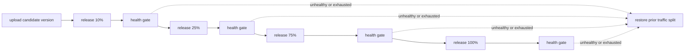

# Release a Worker only while its health remains acceptable

> How do I upload a candidate without releasing it, progressively shift traffic, and roll back on a confirmed regression?

---

Planned integration; no real Worker release is verified here yet.

`deploy` uploads an immutable Worker version without changing traffic. `release`
owns promotion and its reversal, capturing the previous deployment's complete
version/percentage mapping before any change. Rollback restores that mapping,
not the candidate's filesystem snapshot.

Each phase queries version-specific health observations collected after that phase
began. The release layer distinguishes three outcomes:

- **Healthy:** enough data and acceptable error rate; advance immediately.
- **Inconclusive:** insufficient or delayed data; throw a tagged retryable error
  containing the sample, then retry with a bounded one-minute delay.
- **Unhealthy:** conclusive threshold breach; throw a Cloudflare non-retryable
  error, then run the release action's rollback immediately.

Ten retries are a maximum observation budget, not a mandatory ten-minute soak.
Exhausting that budget fails closed and rolls back; missing analytics must never
mean healthy. Late samples and aggregate errors from an old version must not
trigger decisions for the new candidate. Concurrent releases need an ownership
guard so one rollback cannot overwrite another operator's deployment.

Cloudflare's [Analytics SQL binding](https://developers.cloudflare.com/analytics/sql-api/workers-binding/)
can query account-scoped datasets without injecting an API token into a container.
The [version metadata binding](https://developers.cloudflare.com/workers/runtime-apis/bindings/version-metadata/)
provides the version identity for telemetry. Native
[Workflow retries and non-retryable errors](https://developers.cloudflare.com/workflows/build/sleeping-and-retrying/)
provide the health gate's timing semantics.

Verification must cover a real dedicated demo Worker: successful promotion,
inconclusive samples followed by enough data, immediate unhealthy rollback,
observation-budget exhaustion, and preservation of the prior traffic allocation.
Local tests can use deterministic health samples, but they do not earn a hosted ✅.
