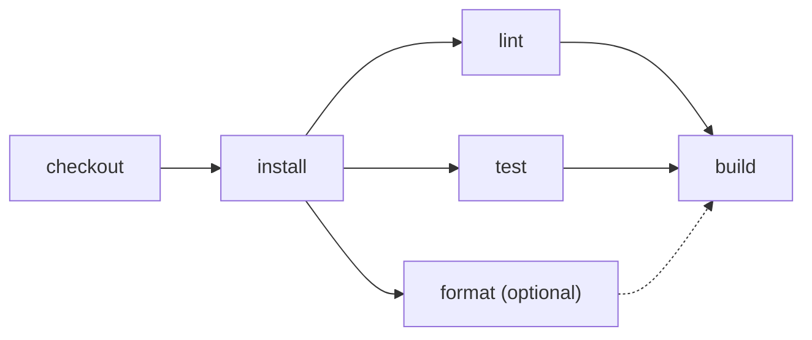

# Preserve immutable attempts

> How can I rerun one action without erasing the previous run or recomputing unrelated work?



---

Every Effect CI execution returns an immutable `attempt`. A rerun receives that attempt
and the selected action IDs. Effect CI follows the plan's explicit `needs` edges, restores
the outputs of unaffected actions, and executes only the selected transitive subgraph.

```ts
let failed: CI.WorkflowAttempt | undefined
await CI.runPromise(workflow, {
  onAttempt: (attempt) => { failed = attempt },
}).catch(() => undefined)
const second = await CI.runPromise(workflow, {
  rerun: { previous: failed!, steps: ["test"] },
})
```

The verification proves that rerunning `test`:

- records failed attempt 1, creates attempt 2, and retains attempt 1 unchanged;
- reuses `checkout`, `install`, `lint`, and `format`;
- executes only `test` and its dependent `build`;
- carries Workspace snapshot handles through the reused action outputs.

Run the ordinary workflow locally with:

```sh
pnpm cf-ci --workflow examples/immutable-attempts/.cloudflare/ci/workflow.ts
```

The forced first-attempt failure and selective rerun are test-only scenarios in
[`ci/tests/immutable-attempts.test.ts`](./.cloudflare/ci/tests/immutable-attempts.test.ts).

This is the portable attempt model. A hosted runner can persist each returned attempt
under its own ID and map a reused Workspace revision to Cloudflare snapshots, GitHub
artifacts, or another checkpoint provider.
