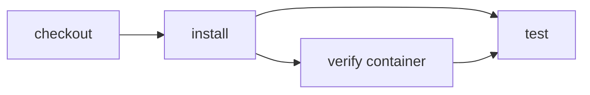

# Run local CI in a container

> How can I run the same Effect CI workflow in an isolated local container?



---

The workflow selects `node:24-bookworm` at its local entrypoint. Effect CI starts one
long-lived Docker container lazily, bind-mounts the example as `/workspace`, and uses
that container for every action. Repository changes remain visible on the host, while
tools or operating-system packages installed during CI remain inside the container.
The exported `local` runner is shared by the executable entrypoint and Effect CI's
GitHub adapter, so both environments interpret the workflow the same way.

Compare:

- [plain GitHub Actions using a job container](./.github/workflows/github.yml)
- [Effect CI on GitHub](./.github/workflows/effect-on-github.yml)
- [the portable actions](./.cloudflare/ci/actions.ts)
- [the workflow and local runner selection](./.cloudflare/ci/workflow.ts)

With Docker running:

```sh
pnpm cf-ci --workflow examples/local-container/.cloudflare/ci/workflow.ts
```

`plan` is intentionally Docker-free because the runner does not start its container
until an action executes a command or reads the workspace:

```sh
pnpm cf-ci --workflow examples/local-container/.cloudflare/ci/workflow.ts plan
```
