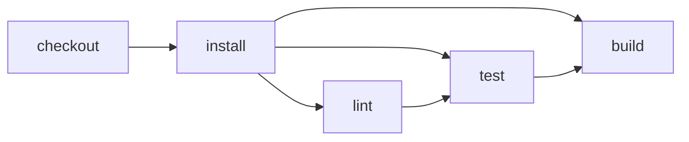

# Node + npm

> How do I run an ordinary npm project with parity between GitHub Actions and
> Effect CI?



---

The fixture is deliberately ordinary: a dependency-free Node application using npm.
Its lockfile also demonstrates JavaScript package-manager inference selecting npm.

Its pipeline focuses only on npm detection and ordinary dependent actions:

```text
checkout → install → lint → test → build
```

See [`../optional-checks`](../optional-checks) for parallel required and optional checks.

Compare:

- [`.github/workflows/github.yml`](./.github/workflows/github.yml): the standalone conventional workflow with its steps inline, based on the current [`setup-node` basic example](https://github.com/actions/setup-node#basic).
- [`.github/workflows/effect-on-github.yml`](./.github/workflows/effect-on-github.yml): the short Effect workflow that calls the testbed's reusable workflow.
- [`.cloudflare/ci/workflow.ts`](./.cloudflare/ci/workflow.ts): the events and
  orchestration for the Effect workflow.
- [`.cloudflare/ci/actions.ts`](./.cloudflare/ci/actions.ts): how each action
  runs and which earlier action is a true blocker.

`cf-ci` is the canonical interface for developers and coding agents. It discovers
[`.cloudflare/ci/workflow.ts`](./.cloudflare/ci/workflow.ts) and executes its default
workflow:

```bash
pnpm exec cf-ci
pnpm exec cf-ci plan --format=json
```

Explicit `--format=text` and `--format=json` override output selection. Without an
override, a directly detected coding agent receives JSON while interactive and hybrid
terminals receive text. See [`../exported-actions`](../exported-actions) for the
opt-in direct-action interface. `--local` is the default; `--remote` selects a
configured remote provider without changing the workflow, and fails with
`CI_REMOTE_UNAVAILABLE` / exit code `3` until the entry point supplies one.

```bash
NODE_ENV=staging pnpm ci:node-npm:dry-run
pnpm ci:node-npm
```

The CLI loads the same workflow value and produces the same structured plan in both
modes. `NODE_ENV` defaults to `test` in CI and `development` elsewhere.

The reusable Effect workflow runs both modes as separate `plan` and `execute` matrix
jobs, setting `DRY_RUN=1` in the plan job's environment.

If this directory becomes its own repository, `.github/workflows/github.yml` is the
complete conventional GitHub Actions setup. The Effect caller also needs the reusable
workflow and CI package published or copied into that repository; packaging those is
a later step.
