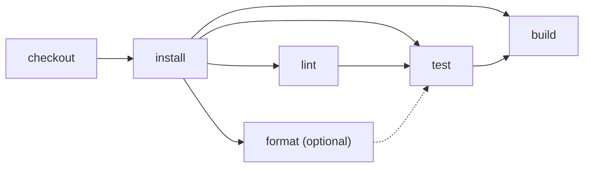

# Node + pnpm

> How do I run the same CI shape with pnpm while keeping package-manager-specific setup
> out of the workflow orchestration?



---

The fixture is a dependency-free Node application whose `packageManager` field and
lockfile demonstrate JavaScript package-manager inference selecting pnpm.

Its pipeline is:

```text
checkout → install → [lint (required) ∥ format (optional)] → test → build
```

The GitHub validation matrix and Effect parallel group express the same concurrency and
failure policy: both branches finish, but only lint blocks the later stages.

Compare:

- [`.github/workflows/github.yml`](./.github/workflows/github.yml): a standalone
  conventional workflow using the current all-in-one [`pnpm/setup`](https://github.com/pnpm/setup)
  action.
- [`.github/workflows/effect-on-github.yml`](./.github/workflows/effect-on-github.yml):
  the small Effect workflow caller.
- [`.cloudflare/ci/workflow.ts`](./.cloudflare/ci/workflow.ts): the events,
  orchestration, and explicitly exported CLI targets for the Effect workflow.
- [`.cloudflare/ci/actions.ts`](./.cloudflare/ci/actions.ts): how each action
  runs and which earlier action is a true blocker.

`cf-ci` discovers `.cloudflare/ci/workflow.ts`, which exposes the same default workflow
and named action targets as the npm example. Text/JSON formats and local/remote
selection belong to the CLI; the inferred package-manager resource is the only runtime
difference.

```bash
NODE_ENV=staging pnpm ci:node-pnpm:dry-run
pnpm ci:node-pnpm
```

If this directory becomes its own repository, `.github/workflows/github.yml` is the
complete conventional GitHub Actions setup. The Effect caller currently relies on
the testbed's reusable workflow and workspace package; publishing that integration
is a later packaging step.

## Hosted coverage

The [hosted example runner](../../apps/example-runner) executes this unchanged
workflow on Cloudflare. `coverage-node-pnpm-20261008-6` completed all six actions,
including frozen installation and parallel checks, with 47 native Workflow steps.
Runner setup installs the pinned pnpm binary; the action stays portable.
