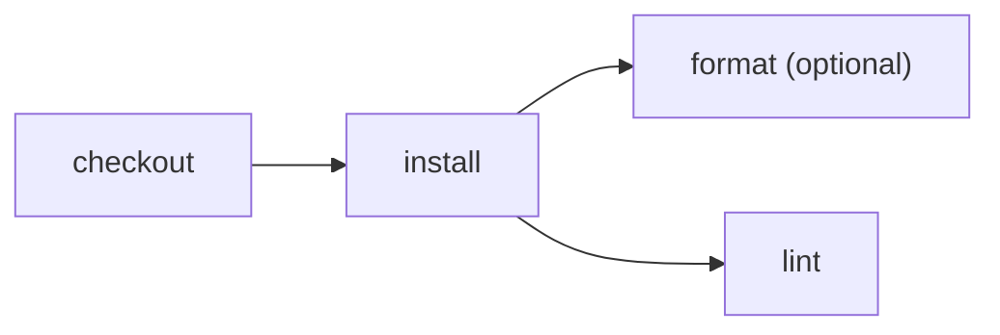

# Required and optional checks

> How do required and optional checks run together without an advisory failure
> blocking the workflow?



---

The fixture deliberately makes `format` fail while `lint` passes. Both implementations
run them in parallel and wait for both outcomes:

- [plain GitHub Actions](./.github/workflows/github.yml) uses a matrix with
  `fail-fast: false` and puts `continue-on-error` on only the `format` step;
- [Effect CI](./.cloudflare/ci/workflow.ts) uses one parallel group and marks only the
  format action optional.

```ts
return yield* CI.parallel([
  actions.lint(),
  CI.optional(actions.format()),
])
```

The overall run succeeds because the required lint check passed. Removing `CI.optional`
or making lint fail makes the Effect workflow fail, matching the conventional GitHub
workflow's policy.

Run it locally:

```sh
pnpm cf-ci --workflow examples/optional-checks/.cloudflare/ci/workflow.ts
```

## Hosted coverage

The same required/optional policy passed in a native Cloudflare Workflow: lint
completed, format warned, and the workflow succeeded. See the
[hosted runner and recorded run](../../apps/example-runner#verified-runs).
