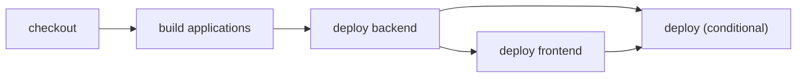

# Deploy dependent applications in order

> How do I guarantee that the backend deploys before the frontend that consumes it?



---

The outer deployment owns the ordering constraint:

```text
checkout → build applications → deploy → backend, then frontend
```

The private `deploy()` action yields both application deployments in their required
order. Each application deployment yields the shared build itself, so it remains valid
when reused by another action. The workflow asks for the aggregate desired state;
the action is intentionally not exported as a public `cf-ci` target.

That separation is intentional. Workflows route external events such as pushes,
deleted branches, deployment hooks, or observability incidents. Projects may expose
selected actions as local commands, but a production deploy should not become one by
accident.

The fixture contains two real Workers. Both are built with `cf build`; then the backend
and frontend are deployed in order with `cf deploy --prebuilt --dry-run`. Dry-run mode
exercises the production bundling and deployment path without credentials or writes.

Compare the conventional [GitHub Actions workflow](./.github/workflows/github.yml) with
the portable [actions](./.cloudflare/ci/actions.ts) and
[workflow](./.cloudflare/ci/workflow.ts).
