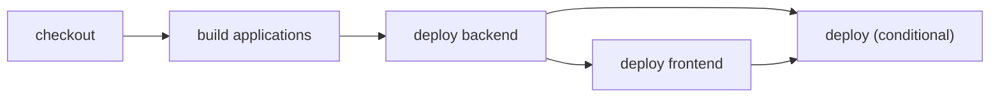

# Deploy dependent applications in order

> How do I guarantee that the backend deploys before the frontend that consumes it?



---

The outer deployment owns the ordering constraint:

```text
checkout → build applications → deploy → backend, then frontend
```

The public `deploy()` action yields both application deployments in their required
order. Each application deployment yields the shared build itself, so it remains valid
when targeted or reused elsewhere. The workflow asks for the aggregate desired state;
locally, a developer or agent can discover it with `cf-ci list` and invoke it directly
with `cf-ci run deploy`.

That separation is intentional. Workflows route external events such as pushes,
deleted branches, deployment hooks, or observability incidents. Exported actions are
the universal local interface. A local `deploy` can be prohibited or supplied a safer
runner implementation without changing what production events invoke.

The fixture records deployment order locally and rejects an out-of-order frontend
deployment. The commands are harmless stand-ins for two Wrangler deployments.

Compare the conventional [GitHub Actions workflow](./.github/workflows/github.yml) with
the portable [actions](./.cloudflare/ci/actions.ts) and
[workflow](./.cloudflare/ci/workflow.ts).
