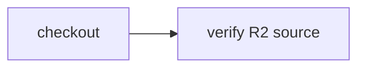

# Materialize source from R2

> How do I run CI against a content-addressed R2 source object without sending storage credentials to a container?



---

Actions only use `CI.Source` and the resulting workspace. The runner supplies an R2
provider, reads a bounded manifest through its Worker binding, validates the SHA-256
of the exact object bytes, and materializes files before checkpointing the workspace.
The subsequent check restores that checkpoint. No R2 credentials enter the container.

[`source.json`](./source.json) is the example source object. Its regular-file manifest
supports binary contents and executable bits, not archives, symlinks or submodules.
The adapter rejects traversal, duplicate paths, file/directory conflicts, malformed
base64, wrong digests, and objects over 96 KiB encoded / 64 KiB decoded / 1,000 files.
A mutable object key or an ETag is not a content identity: every read verifies the
caller-pinned SHA-256, so overwriting the key cannot silently change source.

Run the workflow against the included local source directory:

```sh
pnpm cf-ci --workflow examples/r2-source/.cloudflare/ci/workflow.ts
```

Adapter tests:

```sh
node --test packages/cloudflare/src/r2-source.test.ts
```

The host adapter is in [r2-source.ts](../../apps/example-runner/src/r2-source.ts).
The bucket is private and the example host has no public HTTP execution endpoint.

After deploying the [example host](../../apps/example-runner), upload the exact
manifest bytes and create the native Workflow:

```sh
cf r2 objects put source/6759fef7f59ccbd363fb8c42062fb4903d98070d08da56c6ae873d9a75ea41cd.json \
  --bucket-name effect-ci-example-source --file examples/r2-source/source.json
cf workflows instances create effect-ci-example-r2-source --body '{"instance_id":"my-r2-source-run","params":{"repository":"source/6759fef7f59ccbd363fb8c42062fb4903d98070d08da56c6ae873d9a75ea41cd.json","revision":"6759fef7f59ccbd363fb8c42062fb4903d98070d08da56c6ae873d9a75ea41cd"}}'
```

If the manifest changes, calculate a new SHA-256 and use a new object key and digest;
do not reuse this example hash for different bytes. The host's portable source
parameters use `repository` as the R2 key and `revision` as the pinned digest.

Verified native instance `coverage-r2-source-20261010-1`, Workflow version
`eec420bc-6ddf-4650-8edf-2e090e16ddb2`, Worker deployment
`f81462ad-8d98-448c-95de-4e22aef1d632`: real binding read, snapshot
`d309cecf-6d9c-4461-a3a3-8bb8eb7fbbbd`, and a separate downstream read restoring
`source from r2`. This verifies the R2 provider in Cloudflare; the local runner uses
the included filesystem source. GitHub workflow coverage is tracked separately.
