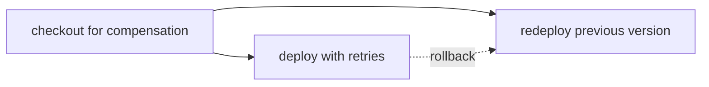

# Roll back only after retries are exhausted

> If deployment still fails after retrying, how does its recovery remain visible?



---

Rollback is part of the action's policy, beside retries:

```ts
export const deploy = CI.action("deploy with retries", deployBody, {
  retries: { limit: 2, delay: 0 },
  rollback,
})
```

The runner exhausts the action's retry policy first. It then invokes the action's
rollback once after terminal failure; rollback is not another retry and does not
pretend external state can be rewound by restoring a filesystem snapshot.

If recovery succeeds, the original failure remains the workflow failure. If recovery
also fails, `CI.RollbackError` preserves both errors.

The [hosted runner](../../apps/example-runner/README.md#native-rollback-policy)
verifies three paths in real Cloudflare Workflows: success leaves rollback skipped;
exhausted native retries run rollback once and preserve the original failure; a later
health failure unwinds completed actions in reverse order. These commands are
echo-only fixtures, not real Worker releases or database reversals. The separate
[health-mediated release](../health-mediated-release) remains a planned real-deployment
integration.

When a later action fails, Effect CI unwinds every completed reversible action in
reverse completion order. The conventional GitHub Actions comparison needs
`continue-on-error` and explicit rollback ordering; Effect CI derives that ordering
from the executed dependency graph.

Run the canonical workflow locally:

```sh
pnpm cf-ci --workflow examples/rollback-compensation/.cloudflare/ci/workflow.ts
```

Compare [the conventional GitHub workflow](./.github/workflows/github.yml) with
[Effect on GitHub](./.github/workflows/effect-on-github.yml). Forced failure and
double-failure assertions live in
[`tests/rollback-compensation.test.ts`](./.cloudflare/ci/tests/rollback-compensation.test.ts).
