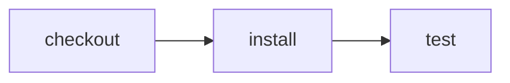

# Choose the GitHub runner without changing CI

> How can the same Effect CI program run on GitHub-hosted, Blacksmith, or self-hosted compute?



---

Runner selection belongs to the GitHub entrypoint, not the portable workflow. Both the
conventional workflow and the Effect-on-GitHub workflow read a repository variable
named `EFFECT_CI_RUNS_ON`. Its value is a JSON array of GitHub runner labels:

```json
["ubuntu-latest"]
```

For a labeled self-hosted runner, it could be:

```json
["self-hosted", "linux", "x64"]
```

A hosted runner provider can use whatever labels its GitHub integration documents.
The default is `ubuntu-latest`, so no repository variable is required.

Compare:

- [plain GitHub Actions](./.github/workflows/github.yml)
- [Effect CI on the selected GitHub runner](./.github/workflows/effect-on-github.yml)
- [the unchanged portable workflow](./.cloudflare/ci/workflow.ts)

Run the same workflow locally:

```sh
pnpm cf-ci --workflow examples/runner-selection/.cloudflare/ci/workflow.ts
```

Cloudflare is marked not applicable for this use-case because a Cloudflare Container,
not a GitHub runner label, selects that compute.
