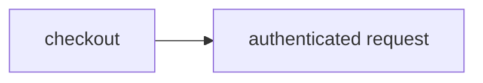

# Authenticate outside the container

> How can a command use a credential without ever receiving its value?



---

The command sends `Bearer effect-ci-placeholder` to `http://credential.ci/verify`.
The runner intercepts that virtual hostname through a host Worker entrypoint.
Only the approved GET path and placeholder may resolve a credential. The proxy
constructs a fresh, fixed-destination request with the real credential, and returns
only a success bit. It forwards neither arbitrary request headers nor upstream
response bodies/headers; redirects and errors fail closed.

The [host adapter](../../apps/example-runner/src/secret-outbound.ts) uses a random,
per-container test credential held in Durable Object storage. It has no privileges
on a real service. Production integrations should resolve Worker secrets or Secrets
Store values in the same host boundary, with service-specific operation scopes.
No credential is put into container environment variables, commands, source files,
or workflow step results. The command explicitly rejects a `PROBE_TOKEN` variable.

The outbound policy is reapplied before commands, including after snapshot restores.
This proves scoped host-side authentication, not complete network confinement:
ordinary internet access remains enabled for checkout, and HTTPS interception is
not exercised. The virtual endpoint is an internal binding, not a public HTTP route.

Run through the [authenticated hosted example runner](../../apps/example-runner):

```sh
cf workflows instances create effect-ci-example-secret-outbound \
  --body '{"instance_id":"secret-outbound-1","params":{"repository":"https://github.com/ericclemmons/effect-ci-testbed.git","revision":"COMMIT_SHA"}}'
```

Proxy policy regressions run with:

```sh
node --test apps/example-runner/src/credential-proxy.test.ts
```

Ordinary local Node execution has no virtual-host interceptor yet; it must not
silently substitute a real token in the command. Local execution remains planned.

Hosted verification: `coverage-secret-outbound-20261009-1` completed checkout,
its snapshot commit, and the authenticated command. The command printed
`host-authentication-verified` after consuming the restored snapshot; native
outputs contain only the placeholder and verification result. Full provenance is
recorded in the [host runner README](../../apps/example-runner/README.md).
