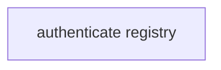

# Declare secrets without putting them in a container

> How does an action require a credential without leaking it into plans, logs, or command environments?



---

```ts
const token = yield* CI.Secret("GITHUB_TOKEN")
```

The plan records only the requirement name. Execution returns an Effect `Redacted`
value from the runner's `SecretResolver`, and JSON/log rendering remains redacted.
`Workspace.exec` deliberately has no `env` or secret injection option: credentials
should be consumed by a host-side capability, RPC service, or an outbound proxy that
substitutes placeholders without exposing values to the workload container.

The default local resolver reads process environment variables. A Varlock adapter,
Cloudflare Secrets Store adapter, or credential-validation approval can implement the
same small resolver contract later.

Run `./examples/secure-secrets/.cloudflare/ci/workflow.ts` locally with a
`GITHUB_TOKEN`, or compare [the conventional GitHub workflow](./.github/workflows/github.yml)
with [Effect on GitHub](./.github/workflows/effect-on-github.yml). Redaction and missing
secret assertions live in
[`tests/secure-secrets.test.ts`](./.cloudflare/ci/tests/secure-secrets.test.ts).
