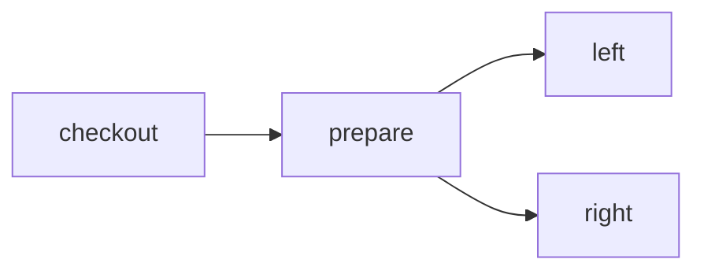

# Fan one prepared workspace out to isolated checks

> How can parallel checks start from the same prepared filesystem without mutating each other?



---

The actions express only their real dependency:

```ts
export const left = CI.action("left", () => function* () {
  const workspace = yield* prepare()

  return yield* workspace.exec("...")
})
```

The workflow runs `left()` and `right()` with `CI.parallel`. `prepare()` executes once
and returns a durable workspace revision. On Cloudflare, each consuming action restores
that same snapshot into a Container selected by the action ID. The two checks both
write `branch.txt`, sleep, and assert their own value remains; they would race and fail
if they shared a filesystem.

[The conventional GitHub version](./.github/workflows/github.yml) expresses the same
shape with a prepared artifact and two matrix jobs. Effect CI does not need an artifact
manifest because the workspace revision is the dependency value.

Run this unchanged workflow in a real Cloudflare account with the
[hosted example app](../../apps/example-runner):

```sh
pnpm --filter @effect-ci-testbed/example-runner exec cf deploy
cf workflows instances create effect-ci-example-snapshot-fanout \
  --body '{"instance_id":"fanout-1","params":{"repository":"https://github.com/ericclemmons/effect-ci-testbed.git","revision":"COMMIT_SHA"}}'
```

The ordinary in-process local runner deliberately does not promise filesystem
isolation. This example uses the Cloudflare runtime because isolated Containers
are the behavior under test. A future local snapshot runner can provide the same
capability without changing these actions.

Hosted verification: `coverage-snapshot-fanout-20261008-1` completed against
`55be3e8c7bff809aa9a8a910f888bc86613922e0`. Native history shows one prepared
checkpoint and both branch commands starting at the same instant. Both wrote the
same filename and passed their own assertions with live workspace reuse disabled.
