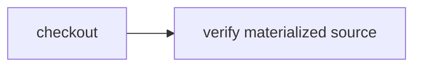

# Swap source providers

> How do I run one unchanged workflow against a local directory, Git checkout, or Cloudflare Artifacts repository?



---

The workflow knows only `CI.Source`:

```ts
const source = yield* CI.Source
const workspace = yield* source.checkout()
```

[`providers.ts`](./.cloudflare/ci/providers.ts) supplies two real implementations. The
filesystem provider returns an existing directory; the Git provider clones and checks
out an immutable revision. The test runs the identical workflow through both.

The [hosted Artifacts provider](../../apps/example-runner/src/artifacts-source.ts)
reads a commit-pinned subtree through a Worker binding, materializes its files, and
returns the same logical workspace. The checkout action is checkpointed normally;
the downstream check restores that snapshot. No repository token is minted or sent
to the container. The binding's namespace is configured in
[`cloudflare.config.ts`](../../apps/example-runner/cloudflare.config.ts).

Run the local providers:

```sh
node --test examples/source-providers/.cloudflare/ci/tests/source-providers.test.ts
```

For the hosted path, first import your repository with `cf artifacts namespaces
repos import`, then deploy the [example host](../../apps/example-runner). This test
provider exports `examples/source-providers` and requires its commit SHA—not a branch:

```sh
cf workflows instances create effect-ci-example-artifacts-source --body '{"instance_id":"my-artifacts-source-run","params":{"repository":"effect-ci-source-example","revision":"5b8ce90769edaf5578f8c52a764de5f2e85e58f5"}}'
```

This focused exporter supports regular files, binary contents, and executable bits,
with a 64 KiB total byte limit, 96 KiB encoded manifest limit, 1,000 entries, and 32 directory levels. It rejects
symlinks, submodules, traversal, missing objects, and mutable refs. The host image
includes Python for filesystem materialization; this is not a full Git clone or a
large-repository streaming exporter.

The `cf` import command currently also issues a Git token. This provider never uses
it; revoke it through `cf artifacts namespaces tokens revoke` if not needed.
The [Workers binding documentation](https://developers.cloudflare.com/artifacts/api/workers-binding/)
describes the underlying read APIs.

R2 and Durable Object source materializers remain planned, not verified.
