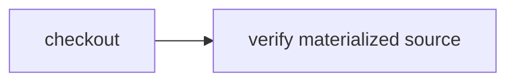

# Swap source providers

> How do I run one unchanged workflow against a local directory or Git checkout?



---

The workflow knows only `CI.Source`:

```ts
const source = yield* CI.Source
const workspace = yield* source.checkout()
```

[`providers.ts`](./.cloudflare/ci/providers.ts) supplies two real implementations. The
filesystem provider returns an existing directory; the Git provider clones and checks
out an immutable revision. The test runs the identical workflow through both.

The separate [Cloudflare Artifacts source example](../artifacts-source) implements
the same contract through a Worker binding without sending Git credentials to the
container.

Run the local providers:

```sh
node --test examples/source-providers/.cloudflare/ci/tests/source-providers.test.ts
```

Durable Object source materialization remains planned.
