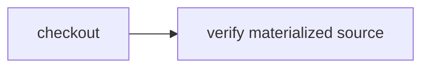

# Swap source providers

> How do I run one unchanged workflow against an existing directory or a fresh Git checkout?



---

The workflow knows only `CI.Source`:

```ts
const source = yield* CI.Source
const workspace = yield* source.checkout()
```

[`providers.ts`](./.cloudflare/ci/providers.ts) supplies two real implementations. The
filesystem provider returns an existing directory; the Git provider clones and checks
out an immutable revision. The test runs the identical workflow through both.

`CI.SourceReference` also defines provider-neutral identities for R2 objects, Durable
Object revisions, and published artifacts. Those Cloudflare materializers remain
unchecked until they restore real remote data; naming their references does not count
as implementing them.
