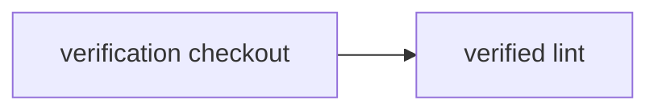

# Reuse signed evidence for side-effect-free checks

> If the exact commit already passed lint locally, can trusted CI avoid doing the same work again?



---

A reusable assertion is a `CI.check`, not an ordinary state-producing action:

```ts
CI.check("lint", () => function* () {
  const workspace = yield* checkout()

  yield* workspace.exec("npm run lint")
}, {
  reuse: { scope: "commit" },
})
```

`CI.check` can only return `void`: success or failure is its entire public result. That
does not magically prove purity—the command must still avoid modifying external state
or producing a workspace consumed later—but it makes the contract visible and prevents
the check from returning a new workspace revision or deployable artifact.

The runner's `CheckCache` decides whether the same check already succeeded for the
exact commit, workflow, command, workspace identity, and policy. It may verify a signed
commit trailer or Git note, find a Vite+/Turbo remote-cache entry, or consult a managed
agent execution record. A valid hit skips the command; a miss, changed revision,
invalid signature, or lookup error runs it normally.

Trust is repository policy, not something the signature decides:

- **Developer-authorized:** a collaborator with push access signs both the commit and
  the verification envelope using an enrolled GPG, SSH, or device key. This proves who
  asserted the result, not that an independent machine observed the execution. It is a
  pragmatic policy for lint, formatting, type checking, and ordinary tests.
- **Managed-agent:** only keys issued to approved agent sandboxes are accepted. This
  reduces trust in arbitrary developer machines while still allowing agents to finish
  checks before pushing.
- **Remote-attested:** local execution dispatches a trusted remote runner, which signs
  the result and returns asynchronously. This gives stronger execution provenance but
  intentionally does not save remote compute.

A signed Git commit by itself is insufficient because it contains no assertion about
which action ran or what result it produced. The evidence needs its own signature (or
must be included in signed commit content) and must bind to that exact commit. The
GitHub App verifies the configured policy and publishes the required check; GitHub is
never asked to trust an arbitrary status submitted by the developer. Repositories can
mix policies—for example, accepting developer proofs for lint while always rerunning
release and security checks remotely.

Only side-effect-free checks belong here. Checkout, install, builds, migrations,
deployments, and artifact-producing work remain ordinary actions even if a runner can
separately cache their bytes or workspace snapshots.

Run the canonical workflow locally with
`./examples/verification-evidence/.cloudflare/ci/workflow.ts`, or through
[Effect on GitHub](./.github/workflows/effect-on-github.yml). The in-memory Ed25519
check cache is test infrastructure, so it lives in
[`tests/verification-evidence.test.ts`](./.cloudflare/ci/tests/verification-evidence.test.ts)
rather than masquerading as the workflow entry point.
