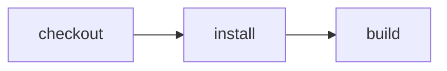

# Reuse the Vite+ task cache

> How can separate CI runs reuse Vite+ task results without teaching Effect CI how
> Vite+ fingerprints a build?



---

The two cache layers have deliberately different jobs:

1. Vite Task owns correctness. `vp run --cache build` observes the command's file reads,
   missing-file probes, directory listings, and writes. On a matching run it restores
   `dist/`, replays the output, and skips the command. The task declares no input or
   output globs.
2. Effect CI owns persistence. After each successful action, the Cloudflare runner saves
   an immutable Container snapshot in a repository- and image-scoped rolling cache. The
   next Workflow instance forks that snapshot before checking out its requested revision.

Vite Task stores its local cache at `node_modules/.vite/task-cache`. The runner protects
that path across destructive commands on Cloudflare. On GitHub, `actions/cache` restores
the same path and the portable install action uses non-destructive `npm install`, so the
restored task cache survives until Vite+ validates it. Effect CI does not hash source
files or decide whether `build` is reusable; Vite+ makes that decision after seeing the
restored cache.

## Compare GitHub and Effect CI

- [`.github/workflows/github.yml`](./.github/workflows/github.yml) installs the app,
  restores Vite Task's directory with `actions/cache`, and invokes Vite+ directly.
- [`.github/workflows/effect-on-github.yml`](./.github/workflows/effect-on-github.yml)
  gives that same directory to the reusable GitHub runner, then executes the portable
  Effect workflow.
- [`src/worker.ts`](./src/worker.ts) gives the same logical cache path to the Cloudflare
  snapshot adapter.

The cache provider changes; the Vite+ command and its correctness model do not.

No Vite+ task configuration is required. The project keeps its ordinary package
script:

```json
{
  "scripts": {
    "build": "node scripts/build.ts"
  }
}
```

`vp run --cache build` opts that existing script into automatic task caching. The
installed Vite+ release spells the flag `--cache` (not `--cached`).

The example's behavioral test verifies a cold miss, restoration of a deleted output,
a hit after an unrelated file changes, and a miss after the file actually read by the
build changes. That test deliberately wraps a shell build rather than a JavaScript
program: Vite+ requires a Node runtime, but the observed task can invoke Python, Rust,
Ruby, a compiler, or any other child process. Effect CI does not require every project
to adopt Vite itself. Manual tracking remains an escape hatch for environment, network,
time, or other dependencies that filesystem observation cannot see.

The userland workflow remains ordinary:

```ts
export const build = CI.action("build", () => function* () {
  const workspace = yield* install()

  return yield* workspace.exec(
    "cd app && npx vp run --cache build",
  )
})
```

Returning the `Workspace` is significant: it tells the runner that this action produced
a new logical filesystem revision. The Cloudflare interpreter snapshots that revision,
including Vite+'s updated task cache. The action does not return a Cloudflare snapshot
or a hand-written artifact manifest.

The portable workflow remains cache-agnostic. The runner declares the tool-owned path
it can persist:

```ts
Cloudflare.workflowEntrypoint(workflow, {
  cache: {
    key: "vite-task",
    keyFiles: ["examples/vite-plus-cache/app/package-lock.json"],
    paths: ["examples/vite-plus-cache/app/node_modules/.vite/task-cache"],
  },
})
```

GitHub supplies the equivalent policy to `actions/cache`. Cloudflare persistence is
still roadmap work: it must merge only Vite+'s cache directory into the current
workspace and must not replace that workspace with an earlier snapshot. Vite+ owns the
fingerprints and cache correctness after the runner makes those bytes available.
