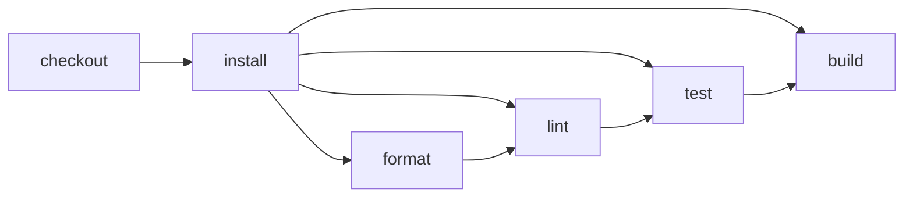

# Infer conventional project tasks

> How do I get an inspectable CI workflow by adding an empty `ci.ts`?



---

The empty [`.cloudflare/ci/ci.ts`](./.cloudflare/ci/ci.ts) is the opt-in. `cf-ci`
discovers `package.json`, detects conventional `format`, `lint`, `check`, `typecheck`,
`test`, and `build` scripts, and synthesizes ordinary CI actions before planning.

Nothing special executes behind the plan: checkout and installation remain visible,
every inferred script is a node, and each script becomes an intentional direct target:

```sh
pnpm exec cf-ci list
pnpm exec cf-ci plan --format=mermaid
pnpm exec cf-ci run lint
pnpm exec cf-ci
```

Adding an explicit default workflow later replaces inference completely. Cloudflare
hosting will require the source manifest to be available during workflow creation, so
that environment remains roadmap work.
